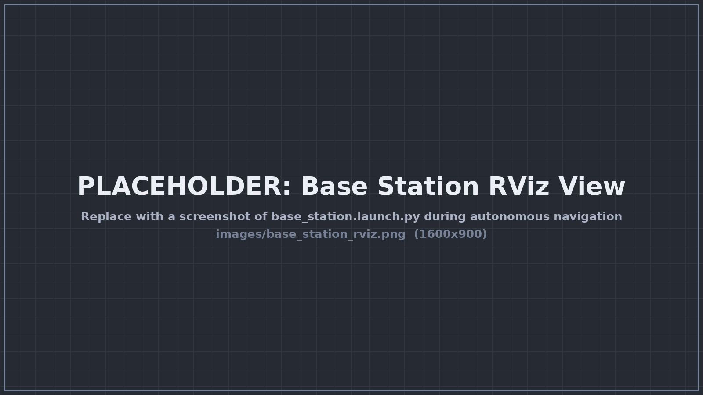
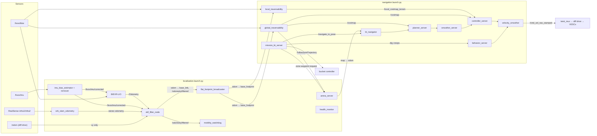
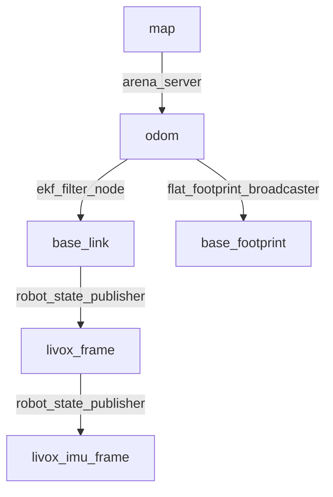

# HOUSECAT

[][ros-jazzy]
[][nav2]
[](#requirements)
[](#license)

**HOUSECAT** (Heuristic Optimization of Unstructured Surface Excavation,
Construction, And Transport) is the autonomy stack for **Perseus**, the QUT
Robotics Club (ROAR) rover built for the 2026 NASA International Lunabotics
Championship. It turns a Livox MID-360 LiDAR, its IMU and a RealSense stereo
camera into a localised rover that plans across unknown regolith, avoids
rocks and craters, digs, carries and dumps, and cycles between the excavation
and construction zones on its own.

Nothing in the core stack depends on the arena. The same localisation and
terrain costmaps drive the rover across
[open, uneven 3D terrain](#open-terrain-navigation) with no prior map.



_The base station view: the operator's RViz, running on a laptop, following the
rover over the network._

## Contents

- [What HOUSECAT does](#what-housecat-does)
- [Open terrain navigation](#open-terrain-navigation)
- [Architecture](#architecture)
- [Packages](#packages)
- [Planners and controllers](#planners-and-controllers)
- [Requirements](#requirements)
- [Building](#building)
- [Quick start](#quick-start)
- [Base station](#base-station)
- [Running missions](#running-missions)
- [Launch file reference](#launch-file-reference)
- [Node reference](#node-reference)
- [Configuration](#configuration)
- [Debugging and tuning](#debugging-and-tuning)
- [Troubleshooting](#troubleshooting)
- [Safety](#safety)
- [Contributing](#contributing)
- [License](#license)
- [See also](#see-also)

## What HOUSECAT does

The name spells out the job:

- **Heuristic Optimization.** Every decision is a scored search, not a fixed
  script: ThetaStar and Smac Lattice search the terrain costmap for the
  cheapest path, DWB scores 200 candidate trajectories per control cycle, and
  `arena_server` scores candidate zone waypoints for clearance and distance.
- **Unstructured Surface.** No prior map, no walls, no flat-floor
  assumption. Terrain is judged cell by cell from the raw 3D scan for slope,
  steps, drops and anything standing proud of the ground.
- **Excavation, Construction, And Transport.** A behaviour tree runs the full
  Lunabotics loop: dig at excavation, carry the load, dump it at
  construction, drive back, repeat.

### Features

- **LiDAR-inertial localisation.** BIEVR-LIO odometry fused with gyro rates,
  ORB-SLAM3 stereo visual odometry and a diff-drive no-sideslip constraint in
  a `robot_localization` EKF.
- **Full 6-DOF state on open 3D terrain.** Slope- and step-aware terrain
  analysis, so the rover navigates open outdoor ground as well as the arena.
- **Arena-frame localisation from fiducials.** `arena_server` fixes the rover
  pose from ArUco markers on the arena rail and publishes `map -> odom`, so
  goals can be given in guidebook coordinates.
- **Terrain-aware costmaps from the raw scan.** Two traversability nodes share
  one height-difference classifier:
  - `global_traversability` remembers the whole arena with log-odds, for the
    planner.
  - `local_traversability` forgets after 1 s over a 6 m-range window, for
    the controller.
- **Three planners and two controllers, switchable live.** ThetaStar
  (default), Smac Lattice and NavFn; Regulated Pure Pursuit (default) and DWB.
  Pick them from the Mission Control panel or a topic, with no restart. See
  [Planners and controllers](#planners-and-controllers).
- **Footprint-true collision checking.** The local costmap, the Lattice
  planner and DWB all use the rover's real 1.68 m × 0.87 m polygon, bucket
  included, not a circle.
- **Behaviour-tree missions.** `mission_bt_server` runs full dig, carry and
  dump cycles, navigation-only cycles and trips, and stand-alone dig or dump
  passes, and reports progress on a latched status topic.
- **Health and slip monitoring.** `health_check` reports rate, bandwidth and
  staleness of every key topic. `watchdog` detects sustained wheel slip by
  comparing commanded velocity against the EKF.
- **Bandwidth-aware base station.** Clouds cross the radio Draco-compressed.
  The base station decodes them, builds the terrain mesh locally, and draws
  the arena from its own copy of the layout file, so only a pose crosses the
  link for the minimap.
- **Manual override always wins.** `twist_mux` ranks the joystick above
  navigation, so holding the deadman takes over from Nav2 at once.

## Open terrain navigation

HOUSECAT isn't limited to a walled arena. It navigates open, uneven 3D terrain
with no prior map:

- **Full 3D state estimation.** BIEVR-LIO and the EKF estimate x, y, z, roll,
  pitch and yaw (`two_d_mode: false`), so slopes, mounds and craters are
  tracked, not flattened away.
- **Terrain analysis, not a flat-floor assumption.** Each cell is judged
  against the local ground from the raw 3D scan. A drivable slope up to
  `max_slope_deg` (40°) reads as free. Steps up (`max_step_up_m`), drops
  (`max_step_down_m`) and anything standing proud of the ground
  (`max_height_above_ground_m`) read as obstacles. Overhead returns above
  `obstacle_height_cap_m` are ignored, so the rover can drive under them.
- **No walls or prior map needed.** Both costmaps come from live LiDAR only.
  `global_traversability` starts at 40 m × 40 m and grows in 10 m steps as
  the rover explores, and unmapped ground is plannable by default.
- **Drift-free classification.** Cells are classified from the last second
  of raw scans, then folded into a log-odds memory. Slow odometry drift
  never shows up as a false step between two visits to the same spot.

### Running outside the arena

Launch localisation and navigation as usual, then send goals in `odom` with
**2D Goal Pose** or `NavigateToPose`. The arena-specific parts are optional:

- Ignore `arena_server`'s `map` frame. It's seeded from the arena starting
  pose and only means something inside the arena.
- The zone missions (`/mission/*`, `/arena/request_*_waypoint`) assume the
  Lunabotics layout. Use plain Nav2 goals or `waypoint_follower` instead.
- On bigger ground, raise `max_range_m` on both traversability nodes, and
  `max_size` in `bievr_mid360.yaml` if the computer has the memory.

### Open terrain limits

- **2.5D planning.** Nav2 plans on a 2D cost grid built from the 3D terrain
  analysis. It can't route over and under the same spot, such as a bridge.
- **Odometry only.** Away from the arena fiducials there's no absolute fix,
  so position drifts slowly over long runs. Add GNSS or another global
  source to the EKF for kilometre-scale missions.
- **Drop-offs.** A real edge often shows up as _no_ returns, not low ones,
  and unknown ground is treated as free. See [Safety](#safety).
- **Tuned for Lunabotics regolith.** The speed limits, stall floors and
  thresholds suit a slow skid-steer on sand. Retune `navigation.yaml` for
  other vehicles or surfaces.

## Architecture

HOUSECAT splits into three layers: localisation, navigation and missions, and
the operator base station. The robot runs the first two; the base station
runs on any machine that shares the robot's ROS domain.



### TF tree

The EKF is the only owner of `odom -> base_link`. BIEVR-LIO publishes no TF of
its own.



- `map` is the **arena frame**: the guidebook Origin Point at the centre of
  the front (south) wall, +X east, +Y north, Z up at grade.
- `odom` is BIEVR-LIO's world frame, and **every Nav2 `global_frame` is
  `odom`**. Goals in `map` still work because Nav2 transforms them through
  `map -> odom`.
- `base_footprint` is `base_link` flattened to the ground plane: z, roll and
  pitch dropped, yaw kept. Nav2's costmaps and controllers use it.

### Rover geometry

`base_link` is **not** at the centre of the rover, which matters for every
footprint and pivot calculation:

- Wheels at x = +0.225 m and −0.625 m, y = ±0.365 m, radius 0.15 m.
- Footprint (`navigation.yaml`, both costmaps) runs from x = −0.775 m to
  +0.90 m, where the bucket in its travel pose reaches, and y = ±0.435 m.
- Pivoting on the spot sweeps a circle of about 0.93 m radius around
  `base_link`. A planner that plans a point through an inflated circle never
  checks that sweep; Lattice and DWB do.

### Velocity path

```text
controller_server ─┐
behavior_server ───┴─> velocity_smoother --(cmd_vel_nav_stamped)--> twist_mux -> diff_drive_controller
                                                                       ^
                                    joy_vel (100) > key_vel (90) > web_vel (80) > nav (10)
```

## Packages

| Package                                          | Kind            | Purpose                                                                                                      |
| ------------------------------------------------ | --------------- | ------------------------------------------------------------------------------------------------------------ |
| [`autonomy_bringup`](autonomy_bringup)           | Launch + config | Launch files, parameters, behaviour trees, lattice primitives and RViz configs for the whole stack.          |
| [`arena_server`](arena_server)                   | C++ node        | Arena layout, fiducial localisation (`map -> odom`), safe zone waypoints, and the base-station minimap node. |
| [`global_traversability`](global_traversability) | C++ node        | Map-wide terrain costmap with log-odds memory, published on `/costmap`.                                      |
| [`local_traversability`](local_traversability)   | C++ node        | Reactive terrain costmap at 10 Hz, published on `/local_costmap_terrain`.                                    |
| [`footprint_broadcaster`](footprint_broadcaster) | C++ node        | Derives `odom -> base_footprint` from the EKF's `odom -> base_link`.                                         |
| [`mission_bt_server`](mission_bt_server)         | C++ node        | BehaviorTree.CPP mission runner behind the RViz Mission Control panel.                                       |
| [`watchdog`](watchdog)                           | C++ node        | Mobility watchdog that detects sustained wheel slip.                                                         |
| [`health_check`](health_check)                   | C++ node        | Type-agnostic topic health monitor: rate, bandwidth, staleness.                                              |

## Planners and controllers

Nav2 splits driving into two jobs:

- A **planner** (`planner_server`) searches the global terrain costmap for a
  whole path from the rover to the goal, about once a second.
- A **controller** (`controller_server`) turns that path into a velocity
  command, 10 times a second, against the live local costmap.

HOUSECAT loads three planners and two controllers at once. The behaviour tree
picks one of each **per goal**, so you can switch between them live without
restarting anything.

### Switching planner and controller

- **Mission Control panel:** the **Planner** and **Controller** dropdowns.
  Both lock while a mission runs.
- **Command line,** before sending the next goal:

  ```shell
  ros2 topic pub -1 /planner_selector std_msgs/String "{data: Lattice}"
  ros2 topic pub -1 /controller_selector std_msgs/String "{data: DWB}"
  ```

Both topics are latched (transient local, reliable), and the behaviour tree's
`PlannerSelector` and `ControllerSelector` read them on every tick. With
nothing published, the defaults in `navigate_to_pose_w_smoothing.xml` apply:
**ThetaStar** and **FollowPath** (RPP).

To check which controller is driving right now, watch `/evaluation`: DWB
publishes it on every cycle (`debug_trajectory_details: true`) and RPP
publishes nothing there.

```shell
ros2 topic hz /evaluation    # messages: DWB is driving; silence: RPP
```

### Loaded planners

| Name (`planner_id`) | Plugin                  | Plans in      | Checks          | Good at                                       | Weak at                                   |
| ------------------- | ----------------------- | ------------- | --------------- | --------------------------------------------- | ----------------------------------------- |
| `ThetaStar`         | Theta\* (any-angle A\*) | x, y          | Inflated circle | Straight, short paths; the default            | Ignores heading; pivots at start and goal |
| `Lattice`           | Smac State Lattice      | x, y, heading | Real footprint  | Fewest pivots; tight gaps; arriving facing in | Turning round for a goal behind the rover |
| `GridBased`         | NavFn (Dijkstra)        | x, y          | Inflated circle | Always finds a path if one exists             | 45°/90° grid corners, more pivoting       |

#### ThetaStar (default)

Any-angle A\*: it takes line-of-sight shortcuts across the grid instead of
being locked to 8-connected moves, so the raw path already has few and gentle
direction changes. It plans a point and ignores the rover's heading, so the
controller pivots onto the path at the start and onto the goal heading at the
end. For a skid-steer that can turn on the spot that's acceptable, and it's
the most predictable of the three.

Key parameters: `w_euc_cost` 1.0 and `w_traversal_cost` 10.0 (shortest path,
but let terrain cost steer it), `how_many_corners` 8, `allow_unknown` true.

#### Lattice (Smac State Lattice)

Plans in x, y **and heading**, from the rover's actual yaw to the goal's,
using precomputed motion primitives: straight moves, 1 m-radius arcs and
turn-in-place. Every pose along the path is checked against the **real
footprint polygon**, so it knows the 0.93 m pivot sweep that a circle planner
never checks.

- Primitives: `config/lattice/diff_10cm_1m_radius.json`, generated with
  Nav2's `generate_motion_primitives.py` for a `diff` model at 0.1 m
  resolution (must equal `/costmap`'s `resolution_m`), 16 headings, 112
  primitives. `navigation.launch.py` passes its absolute path.
- Why 1 m arcs, not 0.5 m: RPP pivots whenever the path 0.5 m ahead is more
  than 0.5 rad off, which a 0.5 m arc always is, so tight arcs became
  stop-and-pivot anyway.
- `rotation_penalty` 5.0: above about 15 it stops pivoting to turn round and
  loops instead (a 2.6 m trip became 7.7 m).
- Forward only (`allow_reverse_expansion: false`), because both controllers
  are tuned to drive forward.

Offline on a synthetic arena costmap, driving each plan with an RPP model:

| Trip                      | Lattice                 | ThetaStar              |
| ------------------------- | ----------------------- | ---------------------- |
| Start → construction      | 4° pivoting, 0 pivots   | 117°, 2 pivots         |
| Construction → excavation | 60°, 1 pivot (+0.95 m)  | 188°, 2 pivots         |
| Excavation → berm face    | 100°, 1 pivot (+0.36 m) | 363°, 3 pivots         |
| Turning round for a goal  | 526°, 9 pivots          | 321°, 2 pivots         |
| 0.93 m gap by boulder_7   | Refuses it              | Plans a clipping pivot |

Use Lattice when the rover must arrive facing a particular way (the berm
face, a dig line) or thread a narrow gap. It is still the challenger:
ThetaStar stays the default until Lattice has been compared on the full zone
cycle in simulation.

#### GridBased (NavFn)

Nav2's classic planner, run as Dijkstra (`use_astar: false`, because NavFn's
A\* is weak at this map size). It always finds a path when one exists, but
the path turns in 45° and 90° grid steps, which the smoother has to clean up
and the controller often has to pivot through. Keep it as a fallback when
the other two fail to plan.

### Loaded controllers

| Name (`controller_id`) | Plugin                                   | How it drives                                     | Obstacles                                   | Reverse             |
| ---------------------- | ---------------------------------------- | ------------------------------------------------- | ------------------------------------------- | ------------------- |
| `FollowPath`           | Regulated Pure Pursuit                   | Geometric arc to one lookahead point on the path  | Stops before a collision; never steers away | No                  |
| `DWB`                  | Rotation Shim wrapping DWB local planner | Simulates and scores 200 trajectories every cycle | Footprint-checked; steers around            | Yes, up to 0.15 m/s |

#### FollowPath: Regulated Pure Pursuit (default)

Geometric and simple. It picks a point 0.4–0.9 m ahead on the path and
drives the arc that reaches it, slowing on tight curvature and on approach.
Above 0.5 rad of heading error it stops and pivots instead of arcing.

- Smooth and predictable on open, clear paths; few parameters.
- Trusts the global path completely. Obstacle knowledge lives upstream in the
  planner; its own collision check only stops the rover.
- Pivots at `rotate_to_heading_angular_vel` 0.175 rad/s, only just above the
  ~0.15 rad/s body-yaw stall, and pivoting is most of its slow time.

#### DWB: Dynamic Window, behind a Rotation Shim

DWB samples 10 linear × 20 angular velocities, simulates each for 2 s, and
scores the resulting trajectories with critics:

| Critic              | Scale | Rewards                                                       |
| ------------------- | ----- | ------------------------------------------------------------- |
| `PathDist`          | 32    | Staying close to the global path                              |
| `PathAlign`         | 32    | Facing along the path (0.325 m ahead of the axle)             |
| `GoalDist`          | 24    | Getting closer to the goal                                    |
| `GoalAlign`         | 24    | Facing the goal                                               |
| `RotateToGoal`      | 32    | Turning to the goal heading once inside the goal tolerance    |
| `ObstacleFootprint` | 0.1   | Clearance for the whole footprint; rejects any lethal contact |
| `PreferForward`     | 10    | Driving forward; reversing and creeping are the exception     |
| `Oscillation`       | —     | Rejects flip-flopping direction                               |

The `RotationShimController` wraps it. When the path is more than 0.785 rad
(45°) off the rover's heading, at the start of nearly every zone leg, the shim
makes **one** committed, footprint-checked pivot at 0.28 rad/s, then hands
over to DWB. With `rotate_to_goal_heading: true` it also does the final turn
to the goal heading. Without the shim, DWB's best left and right pivots
scored within a few points of each other and it dithered between them for
20 s until the progress checker gave up.

Measured in Gazebo on the zone cycle, three navigation-only cycles each, same
waypoints, from the starting zone:

| Metric                    | RPP (`FollowPath`)   | DWB                  |
| ------------------------- | -------------------- | -------------------- |
| Cycles completed          | 3 / 3                | 3 / 3                |
| Total time                | 230.4 s              | 170.8 s              |
| Cycle times               | 78.9 / 83.0 / 68.5 s | 57.3 / 56.6 / 56.9 s |
| Recoveries triggered      | 1                    | 0                    |
| Distance driven           | 37.6 m               | 33.7 m               |
| Time creeping or pivoting | 115 s                | 68 s                 |

What the numbers mean:

- DWB is **more consistent** (cycle times within 1 s of each other) and
  needed **no recoveries**. That is the real gain.
- Most of the raw speed difference is the pivot rate: DWB pivots at
  0.28 rad/s against RPP's 0.175. Before concluding DWB is faster, run RPP
  with its pivot raised to match:
  `ros2 param set /controller_server FollowPath.rotate_to_heading_angular_vel 0.28`.

Trade-offs:

- **DWB:** handles obstacles near the awkward footprint better and can back
  up, but costs more CPU (200 rollouts per cycle on the Orange Pi), has eight
  interacting critic weights to tune, and its commands come from a discrete
  sample grid, so they are slightly choppier.
- **RPP:** smoother continuous arcs and far fewer knobs, but it never
  deviates from the planned path to avoid something.

Rule of thumb: **DWB in cluttered ground or near zone walls, RPP on open,
clear paths.**

### Nav2 options available but not loaded

Every package below is installed in the devenv (`ros2 pkg list`). Add the
plugin to `planner_plugins` or `controller_plugins` in `navigation.yaml`, add
its option to the Mission Control panel's list, and it becomes selectable the
same way.

| Option                  | Package                         | Kind       | Fit for Perseus                                                                                                                       |
| ----------------------- | ------------------------------- | ---------- | ------------------------------------------------------------------------------------------------------------------------------------- |
| Smac 2D                 | `nav2_smac_planner`             | Planner    | Good. Cost-aware 8-connected A\*, a better-behaved NavFn. Ignores heading like ThetaStar.                                             |
| Smac Hybrid-A\*         | `nav2_smac_planner`             | Planner    | Poor. Built for car-like turning radii (Dubins / Reeds-Shepp); cannot use the rover's turn-in-place. Lattice covers this need better. |
| MPPI                    | `nav2_mppi_controller`          | Controller | **Do not use.** The Nix build (xtensor 0.25) reverses away from a straight path. It was removed from the stack.                       |
| Graceful                | `nav2_graceful_controller`      | Controller | Worth trying. Smooth pose-following control law for diff drives, with its own in-place rotation; lighter than DWB.                    |
| Rotation Shim           | `nav2_rotation_shim_controller` | Wrapper    | Already used around DWB. Could also wrap RPP, but RPP has its own rotate-to-heading.                                                  |
| Savitzky-Golay smoother | `nav2_smoother`                 | Smoother   | Cheap noise smoothing; doesn't reduce corners as much as the simple smoother.                                                         |
| Constrained smoother    | `nav2_constrained_smoother`     | Smoother   | Respects a minimum turning radius and keeps clearance; slower. Worth trying with ThetaStar.                                           |

### Path smoothing

Every path from `ComputePathToPose` goes through `smoother_server`'s
`simple_smoother` (`w_data` 0.2, `w_smooth` 0.3, 0.2 s budget) with
`check_for_collisions` on, against the planner's own costmap. If smoothing
fails or would clip an obstacle, the tree carries on with the raw path rather
than failing navigation. `NavigateThroughPoses` (waypoint following) uses
Nav2's stock tree and is **not** smoothed.

### Recovery behaviours

`navigate_to_pose_w_smoothing.xml` retries a goal up to 6 times. Between
tries it cycles round-robin through:

1. Clear both costmaps.
1. Spin 90° (`spin_dist` 1.57) at 0.4 rad/s.
1. Wait 5 s.
1. Back up 0.30 m at 0.15 m/s.

`behavior_server` also loads `drive_on_heading`, which the dig uses for its
creeps.

## Requirements

- **ROS 2 Jazzy** on Ubuntu 24.04, or the repository's Nix `devenv` shell,
  which pins the distro for you.
- A C++20 compiler and CMake ≥ 3.23.
- ROS dependencies:
  - `navigation2` (planner, controller, smoother, behaviors, bt_navigator,
    waypoint_follower, velocity_smoother, lifecycle_manager)
  - `nav2_theta_star_planner`, `nav2_smac_planner`,
    `nav2_regulated_pure_pursuit_controller`, `dwb_core`,
    `nav2_rotation_shim_controller`
  - `robot_localization`
  - `behaviortree_cpp` (BTCPP v4) and `nav2_behavior_tree`
  - `tf2_ros`, `visualization_msgs`, `nav_msgs`, `sensor_msgs`, `std_srvs`
- Perseus workspace packages HOUSECAT depends on:
  - `bievr_lio_ros2`: LiDAR-inertial odometry.
  - `interfaces`: `LocaliseInArena`, `RequestZoneWaypoint`, `StartMission`,
    `MissionStatus`, `MobilityStatus`, `SystemHealth` and friends.
  - `sensors`: Livox and RealSense drivers, IMU bias processing, Draco
    point-cloud compression, `cloud_mesher`.
  - `vision`: `orb_slam_odometry` (ORB-SLAM3 stereo VO) and the ArUco
    detector.
  - `perseus`: `twist_mux` and the diff-drive controller.
  - `payloads`: the bucket's `FollowJointTrajectory` controller.
  - `teleop`: joystick override.
  - `rviz_plugins`: Topic Health, Arena Minimap, Mobility Efficiency,
    Mission Control and View Lock panels.

### Hardware

| Component                                   | Used for                         |
| ------------------------------------------- | -------------------------------- |
| Livox MID-360 (LiDAR + built-in IMU)        | Odometry, terrain costmaps       |
| Intel RealSense D455                        | Stereo odometry, ArUco fiducials |
| Diff-drive base on VESC ESCs                | Motion, sideslip constraint      |
| Bucket: lift, tilt and clamshell jaw        | Digging and dumping              |
| Onboard computer (Jetson / Orange Pi class) | Runs localisation and navigation |
| Operator laptop + gamepad                   | Base station and manual override |

## Building

HOUSECAT lives inside the `perseus-v3` ROS workspace at
`software/ros_ws/src/nav-stack`.

### Building with the Nix devenv

From the repository root, enter the development shell (it loads automatically
with `direnv`) and build:

```shell
cd perseus-v3
devenv shell
cd software/ros_ws
colcon build --packages-up-to autonomy_bringup
source install/setup.bash
```

### Building in a plain ROS 2 workspace

```shell
source /opt/ros/jazzy/setup.bash
cd software/ros_ws
rosdep install --from-paths src --ignore-src -r -y
colcon build --packages-up-to autonomy_bringup \
    --cmake-args -DCMAKE_BUILD_TYPE=RelWithDebInfo
source install/setup.bash
```

> [!NOTE]
> Packages default to a `Debug` build. A `Release` build is promoted to
> `RelWithDebInfo` so stack traces keep their symbols, and any `Rel*` build
> compiles with `-Werror`.

If `colcon` fails after a `git pull` for no obvious reason, clean and rebuild:
`colcon clean workspace -y && colcon build`.

## Quick start

Start the robot in this order, one terminal each. The sensors and robot
description must be up before odometry can publish.

### Running on the robot

1.  Start the sensor drivers (Livox and RealSense):

    ```shell
    ros2 launch sensors sensors.launch.py
    ```

1.  Start the base: robot description, `twist_mux` and the diff-drive
    controller:

    ```shell
    ros2 launch perseus perseus.launch.py
    ```

1.  Start localisation. **Keep the rover still for the first ~2 s** while
    BIEVR-LIO levels its world frame from the IMU (`imu.t_init`).

    ```shell
    ros2 launch autonomy_bringup localisation.launch.py
    ```

    Pass `enable_sensors:=true` instead of running step 1 to have this file
    start the Livox and RealSense itself. That also composes
    `orb_slam_odometry` into the camera container, which gets the infra pair
    at 30 Hz instead of about 4 Hz standalone.

1.  Start navigation. **From here the rover can move.**

    ```shell
    ros2 launch autonomy_bringup navigation.launch.py
    ```

### Running the base station

On the operator laptop, on the same `ROS_DOMAIN_ID`, with the gamepad plugged
in:

```shell
ros2 launch autonomy_bringup base_station.launch.py
```

Click **2D Goal Pose** in RViz to send the rover somewhere, or use the Mission
Control panel to run a full mission.

### Running in simulation

The Gazebo simulation lives in the separate `perseus_simulation` workspace.
Start it **first**, then localisation, then navigation. Starting localisation
before the simulator publishes `/clock` makes BIEVR-LIO diverge.

```shell
# In perseus_simulation
pixi run sim

# In perseus-v3, one terminal each
ros2 launch autonomy_bringup localisation.launch.py sim:=true use_sim_time:=true
ros2 launch autonomy_bringup navigation.launch.py use_sim_time:=true
ros2 launch autonomy_bringup base_station.launch.py use_sim_time:=true
```

- `sim:=true` layers `bievr_mid360_sim.yaml` over the real-robot LIO config to
  accept Gazebo's untimed point cloud. The argument is `sim`, not `is_sim`;
  an unknown argument is silently ignored.
- The rover spawns in the starting zone at (−1.125, 1.125), facing north.
- Every terminal needs the same DDS environment. A full sim plus stack runs
  about 45 DDS participants, so raise CycloneDDS's
  `MaxAutoParticipantIndex` from its default:

  ```shell
  export ROS_DOMAIN_ID=87
  export ROS_AUTOMATIC_DISCOVERY_RANGE=LOCALHOST
  export CYCLONEDDS_URI="$CYCLONEDDS_URI,<CycloneDDS><Domain><Discovery><MaxAutoParticipantIndex>100</MaxAutoParticipantIndex></Discovery></Domain></CycloneDDS>"
  ```

## Base station

`base_station.launch.py` is everything an operator needs, and nothing that
estimates or plans. It runs:

- **RViz** with `rviz/base_station.rviz`, wrapped in nixGL by default.
- **Draco decoders** (`sensors/point_cloud_decompress.launch.py`) that turn
  the rover's compressed clouds back into
  `/livox/lidar/downsampled/decompressed` and
  `/Laser_map/downsampled/decompressed`.
- **`cloud_mesher`**, which rebuilds a terrain surface from the decoded map
  and publishes it on `/mesh`. It runs here on purpose: a triangle mesh is
  roughly ten times the bytes of the cloud it came from, so it never touches
  the radio link.
- **The joystick override** (`teleop/controller.launch.py`), which stays live
  even with `rviz_only:=true`.

### RViz panels

| Panel               | Topic                       | Shows                                                                                                       |
| ------------------- | --------------------------- | ----------------------------------------------------------------------------------------------------------- |
| Topic Health        | `/health_check/health`      | Rate, bandwidth and staleness per monitored topic. The fastest way to tell a link problem from a dead node. |
| Arena Minimap       | `/arena/robot_pose`         | 2D overhead arena with rover position and heading, drawn from the local layout file.                        |
| Mobility Efficiency | `/watchdog/mobility_status` | Percentage of commanded linear and angular motion achieved.                                                 |
| Mission Control     | `/mission/*`                | Mode, task, cycles, zone points, bucket prep, planner and controller; Start, Stop and progress.             |
| View Lock           | —                           | Locks the camera to preset follow views.                                                                    |

### Mission Control panel

- **Operation mode:** Full Autonomy, Navigation Only, Dump only or Dig only.
  See [Mission modes](#mission-modes).
- **Task and cycles:** for Navigation Only, cycle between zones or a single
  trip to one zone; the number of cycles.
- **Zone waypoints:** per zone, **Map point** (picked with the
  **ExcavationPoint** or **ConstructionPoint** tool, click-drag like 2D Goal
  Pose) or **Arena auto** (`arena_server` picks a safe point). Hidden for Dump
  only and Dig only, which don't drive between zones.
- **Bucket:** move the bucket to its travel pose before setting off.
- **Planner** and **Controller:** published latched on `/planner_selector` and
  `/controller_selector`. See
  [Planners and controllers](#planners-and-controllers).
- **Start / Stop:** while a mission runs, Start shows progress and the whole
  configuration locks, so what the panel shows is what the rover is doing.

All of it is saved in the RViz config. After rebuilding `rviz_plugins`,
restart `base_station.launch.py` to load the new panel.

### RViz displays

| Display              | Topic                                   |
| -------------------- | --------------------------------------- |
| Livox Cloud          | `/livox/lidar/downsampled/decompressed` |
| Cloud Map            | `/Laser_map/downsampled/decompressed`   |
| Global Mesh Map      | `/mesh`                                 |
| Footprint (odometry) | `/odometry/filtered`                    |
| Path                 | `/plan_smoothed`                        |
| Global 2D Projection | `/layers/obstacle`                      |
| Global Inflation     | `/layers/inflation`                     |
| Local 2D Projection  | `/local_costmap/costmap`                |
| Arena Zones          | `/arena/zones`                          |
| Mission Waypoints    | `/mission/waypoint_markers`             |
| Detection Overlay    | `/vision/overlay/image/compressed`      |

The fixed frame is `odom`.

## Running missions

`mission_bt_server` runs `behavior_trees/mission.xml`. It decides **where** to
go, **in what order**, and **what the bucket does**. Every drive is a call
into bt_navigator's `/navigate_to_pose`, so planning, smoothing, replanning
and recovery all come from `navigate_to_pose_w_smoothing.xml`, using whichever
planner and controller are selected.

### Mission modes

| Mode                  | Task                     | Behaviour                                                                    |
| --------------------- | ------------------------ | ---------------------------------------------------------------------------- |
| `FULL_AUTONOMY` (0)   | ignored                  | To excavation, then `cycles` × (dig → construction → dump → excavation).     |
| `NAVIGATION_ONLY` (1) | `CYCLE` (0)              | To excavation, then `cycles` × (construction → excavation), no bucket steps. |
| `NAVIGATION_ONLY` (1) | `GO_TO_EXCAVATION` (1)   | One trip to the excavation point.                                            |
| `NAVIGATION_ONLY` (1) | `GO_TO_CONSTRUCTION` (2) | One trip to the construction point.                                          |
| `DUMP_ONLY` (2)       | ignored                  | No driving: one `DumpBucket` where the rover stands.                         |
| `DIG_ONLY` (3)        | ignored                  | One `DigBucket` pass from where the rover stands; only the dig's own creeps. |

A cycle is counted on arrival back at excavation. `prepare_bucket` applies in
every mode.

### Digging

`DigBucket` makes one pass, with the rover facing the regolith to cut. Values
are `mission_bt_server`'s `dig_*` parameters, defaults shown. Angles are in
degrees: lift positive lowers the arms, tilt positive tips the bucket down.

1. Tilt 28, jaw 0: cutting edge down, clamshell shut.
1. Lift 32: arms down until the edge is in the regolith.
1. Creep 0.20 m forward at 0.08 m/s, cutting.
1. Tilt −28: curl the bucket up to hold the load.
1. Creep 0.40 m forward while the arms rise to lift 0, the carrying pose.

The creeps are Nav2's `DriveOnHeading`, so they go through the velocity
smoother and `twist_mux` like any Nav2 motion, and are collision-checked
against the local costmap. One that sees an obstacle ahead stops and fails the
dig.

### Dumping

`DumpBucket` runs at construction. Each step is one `MoveBucket` goal, and
joints a step doesn't name hold where they are:

1. Lift 20 and tilt 20 together, to lower the arms and tip the bucket.
1. Jaw to 36, to open the clamshell.
1. Tilt to −20, to curl back and empty the rest.
1. The travel pose with the jaw closed, all three joints at once.

Each move takes `bucket_move_s` (10 s). If a step fails, the mission fails
there, with the rover still at construction.

### Zone waypoints

For each zone, the waypoint comes either from a point picked in RViz or, with
`use_arena_*: true`, from `arena_server`. The server scores candidates inside
the zone against `/costmap` for clearance and distance to the rover. The
construction point keeps `construction_clearance_radius_m` (0.6 m) clear of
obstacles, so the rover isn't sent to a spot it can only reach by grazing a
rock.

### Bucket travel pose

With `prepare_bucket: true` (the Mission Control panel's **Bucket** tick box,
on by default), the mission first runs the `PrepareBucket` subtree: every
bucket joint to 0°, then the travel pose. The default pose is lift 25°,
tilt −20° (curled), jaw 0°. It keeps the bucket out of the MID-360's and
D455's view of the ground from 2 m ahead while leaving about 0.17 m of ground
clearance. With the arms up (lift 0) the bucket hides most of the LiDAR's
far-field ground returns.

| Parameter                | Default                                                          |
| ------------------------ | ---------------------------------------------------------------- |
| `bucket_action_name`     | `/payloads/bucket_trajectory_controller/follow_joint_trajectory` |
| `bucket_travel_lift_deg` | `25.0`                                                           |
| `bucket_travel_tilt_deg` | `-20.0`                                                          |
| `bucket_travel_jaw_deg`  | `0.0`                                                            |
| `bucket_move_s`          | `10.0` (each move's `time_from_start`)                           |

Each move is a `MoveBucket` node: one `FollowJointTrajectory` goal, which
succeeds when the bucket controller reports the pose reached. If the
controller isn't running, the mission fails at `bucket_to_zero` before the
rover drives. Missions without `prepare_bucket`, and navigation-only missions,
never touch the bucket. Stopping the mission mid-move cancels the goal, and
the bucket holds where it is.

### Mission phases

`/mission/status` reports the current `phase`:

- Driving: `to_excavation`, `to_construction`.
- Bucket prep: `bucket_to_zero`, `bucket_to_travel`.
- Dig: `dig_tilt`, `dig_lower`, `dig_push`, `dig_curl`, `dig_carry`.
- Dump: `dump_lower_tip`, `dump_open_jaw`, `dump_curl`, `dump_stow`.
- `done`.

### Mission commands from the CLI

The Mission Control panel wraps these services.

```shell
# Two navigation-only cycles, with arena_server picking both waypoints
ros2 service call /mission/start interfaces/srv/StartMission \
    "{mode: 1, task: 0, cycles: 2, use_arena_excavation: true, use_arena_construction: true}"

# Full autonomy, two dig-and-dump cycles, bucket to its travel pose first
ros2 service call /mission/start interfaces/srv/StartMission \
    "{mode: 0, cycles: 2, use_arena_excavation: true, use_arena_construction: true, prepare_bucket: true}"

# Dump once where the rover stands
ros2 service call /mission/start interfaces/srv/StartMission "{mode: 2}"

# Dig once from where the rover stands
ros2 service call /mission/start interfaces/srv/StartMission "{mode: 3}"

# Watch progress (latched: late subscribers get the current state at once)
ros2 topic echo /mission/status

# Cancel
ros2 service call /mission/stop std_srvs/srv/Trigger

# One-shot trips to a safe point in a zone
ros2 service call /mission/go_to_excavation_zone std_srvs/srv/Trigger
ros2 service call /mission/go_to_construction_zone std_srvs/srv/Trigger
```

### Localising in the arena

`arena_server` seeds `map -> odom` at startup from `initial_pose` (the centre of
the starting zone, facing north). The guidebook randomises the real start pose,
so correct it with a fiducial fix once at least two rail markers are in view:

```shell
ros2 service call /arena/localise interfaces/srv/LocaliseInArena "{timeout_s: 2.0}"
```

The response carries the pose, the marker IDs used, and `residual_m`, the RMS
error of the rigid fit. Gate on `residual_m`: it jumps if a detection is
spurious or a marker has been moved.

## Launch file reference

All launch files are in `autonomy_bringup/launch`.

### `localisation.launch.py` arguments

Brings up the IMU bias container, BIEVR-LIO, the EKF, `orb_slam_odometry` and
the ArUco detector (via `vision.launch.py`), `flat_footprint_broadcaster`,
`arena_server`, `mobility_watchdog`, `health_monitor` and the rover-side Draco
compressor.

| Argument            | Default                  | Description                                                               |
| ------------------- | ------------------------ | ------------------------------------------------------------------------- |
| `sim`               | `false`                  | Layer `bievr_mid360_sim.yaml` for Gazebo's point cloud.                   |
| `use_sim_time`      | `false`                  | Use `/clock`. The EKF waits forever if nothing publishes it.              |
| `rviz`              | `false`                  | Open BIEVR-LIO's own RViz config.                                         |
| `ekf_params_file`   | `config/ekf_config.yaml` | EKF parameters.                                                           |
| `bievr_params_file` | _(empty)_                | Replace `bievr_mid360.yaml`, e.g. to A/B test against a bag.              |
| `enable_sensors`    | `false`                  | Start the Livox and RealSense from this file. Strictly `true` or `false`. |
| `interface`         | `enP3p49s0`              | Network interface the Livox driver reads the host IP from.                |
| `aruco`             | `true`                   | Launch the ArUco detector.                                                |
| `cube`              | `false`                  | Launch the cube detector.                                                 |
| `overlay`           | `true`                   | Launch the detection overlay.                                             |

### Visual odometry: ORB-SLAM3

The EKF's second pose source (`odom1`) is `vision`'s `orb_slam_odometry`:
ORB-SLAM3 in stereo mode on the D455 infra pair. It replaced libviso2, whose
scale was badly off (about 0.33x of the LIO's displacement on
`rock_nav_test_2`).

- **Output never jumps.** ORB-SLAM3's pose jumps on relocalisation, a new map
  or a map correction. The node publishes only the step between consecutive
  tracked frames in the same map. Across any discontinuity it publishes an
  identity step with variance 9999, which the EKF ignores.
- **Covariance follows tracking.** The `covariance.*` variances in
  `vision/config/vision.yaml` hold while 150+ map points are tracked, and scale
  up as fewer are, to at most 20x. Below 30 points the step counts as lost.
- **Loop closing is off.** An odometry source has no use for it, and it costs
  CPU in bursts.
- **Startup.** ORB-SLAM3 loads a 139 MB text vocabulary on the first stereo
  pair, which takes about 5 s on a desktop and longer on the Orange Pi.
  Nothing is published until then.
- **CPU.** Frames are thinned to `processing_frequency_hz` (15 Hz). Tracking
  took 17 ms median per frame on a desktop. Check the time per frame
  (`/vision/orb_slam_odometry/info`, `runtime_s`) on the Orange Pi before
  raising it.

Replayed `rock_nav_test_2` (first 240 s, about 30 m driven): 5 s displacement
was 0.94x the LIO's (libviso2 0.32x); 92% of frames tracked, 3 steps rejected
as jumps, no map changes.

The library is the headless `orb-slam3` Nix package
(`nix/extra-packages/patches/orb-slam3`), which also installs the vocabulary.

### `navigation.launch.py` arguments

Brings up both traversability nodes, the Nav2 servers, `mission_bt_server` and
the lifecycle manager. Everything is configured from `config/navigation.yaml`;
the launch file adds the absolute paths of the behaviour trees and the lattice
primitives file.

| Argument       | Default | Description   |
| -------------- | ------- | ------------- |
| `use_sim_time` | `false` | Use `/clock`. |

Prerequisites: `localisation.launch.py` for TF, and `perseus.launch.py` for
`twist_mux` and the diff-drive controller.

### `base_station.launch.py` arguments

| Argument          | Default                  | Description                                                            |
| ----------------- | ------------------------ | ---------------------------------------------------------------------- |
| `rviz_config`     | `rviz/base_station.rviz` | RViz config to open.                                                   |
| `use_sim_time`    | `false`                  | Honour `/clock` when following a simulated robot.                      |
| `use_nixgl`       | `true`                   | Wrap RViz in nixGL. Set `false` on a machine with working GPU drivers. |
| `decompress`      | `true`                   | Run the Draco decoders.                                                |
| `mesh`            | `true`                   | Run `cloud_mesher` on the decoded map. Needs `decompress:=true`.       |
| `minimap`         | `false`                  | Publish arena zones as 3D markers. The RViz panel does not need this.  |
| `rviz_only`       | `false`                  | Launch RViz alone; overrides `decompress`, `mesh` and `minimap`.       |
| `teleop`          | `true`                   | Run the joystick override.                                             |
| `controller_type` | `taranis`                | One of `taranis`, `xbox`, `logitech`, `8bitdo`.                        |

### Other launch files

| Launch file                                   | Purpose                                                             |
| --------------------------------------------- | ------------------------------------------------------------------- |
| `ekf.launch.py`                               | The EKF on its own (`params_file`, `use_sim_time`, default `true`). |
| `arena_server.launch.py`                      | `arena_server` with `arena_layout.yaml` and `arena_layout.json`.    |
| `arena_minimap.launch.py`                     | Base-station 3D minimap markers from the local layout file.         |
| `health_check/launch/health_check.launch.py`  | Health monitor (`config_file`).                                     |
| `watchdog/launch/mobility_watchdog.launch.py` | Mobility watchdog (`use_sim_time`).                                 |

## Node reference

### `arena_server`

Owns the arena frame, localises against rail fiducials on request, and picks
safe waypoints inside mission zones.

| Interface    | Name                                   | Type                                                     |
| ------------ | -------------------------------------- | -------------------------------------------------------- |
| TF broadcast | `map -> odom`                          | seeded from `initial_pose`, refined by `/arena/localise` |
| Service      | `/arena/localise`                      | `interfaces/srv/LocaliseInArena`                         |
| Service      | `/arena/request_excavation_waypoint`   | `interfaces/srv/RequestZoneWaypoint`                     |
| Service      | `/arena/request_construction_waypoint` | `interfaces/srv/RequestZoneWaypoint`                     |
| Subscribes   | `/vision/aruco/detections`             | `interfaces/msg/DetectionArray` (on demand only)         |
| Subscribes   | `/costmap`                             | `nav_msgs/OccupancyGrid`                                 |
| Publishes    | `/arena/zones`                         | `visualization_msgs/MarkerArray` (transient local)       |
| Publishes    | `/arena/robot_pose`                    | `geometry_msgs/PoseStamped` (5 Hz)                       |

Localisation needs **at least two markers**. The fit uses marker positions
(closed-form 2D Kabsch), because a single marker's orientation has measured
yaw errors of up to 9.4°. The node refuses to start without `layout_file`
rather than fall back to a built-in arena.

### `arena_minimap`

Also in the `arena_server` package, run on the base station. It reads the same
`arena_layout.json`, subscribes to `/arena/robot_pose`, and publishes
`/minimap/zones` and `/minimap/robot` markers. The rover marker greys out after
`pose_timeout_s` (3 s) without a pose, rather than vanishing.

### `global_traversability`

| Interface  | Name                                                     | Notes                                     |
| ---------- | -------------------------------------------------------- | ----------------------------------------- |
| Subscribes | `/livox/lidar`                                           | best effort                               |
| Publishes  | `/costmap`                                               | `nav_msgs/OccupancyGrid`, transient local |
| Publishes  | `/layers/{log_odds,elevation,border,obstacle,inflation}` | debug grids                               |

Every `update_period_s` (0.5 s) it classifies the last `point_buffer_s` (1 s)
of raw scans out to `max_range_m` (10 m) and folds each observed cell's
verdict into a persistent log-odds. Unobserved cells keep their last value,
and a removed rock clears the next time the LiDAR looks at it. The grid grows
in 10 m steps as the rover explores.

### `local_traversability`

| Interface  | Name                                                                                                  | Notes                                  |
| ---------- | ----------------------------------------------------------------------------------------------------- | -------------------------------------- |
| Subscribes | `/livox/lidar`                                                                                        | best effort                            |
| Publishes  | `/local_costmap_terrain`                                                                              | `nav_msgs/OccupancyGrid`, **volatile** |
| Publishes  | `/local_layers/{elevation,step_up,step_down,height_above_ground,clearance,border,obstacle,inflation}` | debug grids                            |

Rebuilds a window out to `max_range_m` (6 m) at 10 Hz and throws it away every
cycle. It is a plain node, not a lifecycle node. Without TF or scans it logs a
throttled `Dropping scan` and Nav2 falls back to the global map alone.

### The terrain classifier

Both traversability nodes share `terrain_analysis.hpp`. A cell is an obstacle
when, against the lowest return within `ground_window_m` (with a
`max_slope_deg` allowance), its floor steps up more than `max_step_up_m`,
something stands higher than `max_height_above_ground_m`, or it drops more than
`max_step_down_m`. Blobs smaller than `min_obstacle_cells` are erased, then the
result is inflated the same way as Nav2's `InflationLayer`, out from
`robot_radius_m`.

### `flat_footprint_broadcaster`

Looks up `odom -> base_link` and broadcasts `odom -> base_footprint` at
`publish_rate_hz` (30 Hz), keeping x, y and yaw.

### `mission_bt_server`

| Interface     | Name                               | Type                                                       |
| ------------- | ---------------------------------- | ---------------------------------------------------------- |
| Service       | `/mission/start`                   | `interfaces/srv/StartMission`                              |
| Service       | `/mission/stop`                    | `std_srvs/srv/Trigger`                                     |
| Service       | `/mission/go_to_excavation_zone`   | `std_srvs/srv/Trigger`                                     |
| Service       | `/mission/go_to_construction_zone` | `std_srvs/srv/Trigger`                                     |
| Publishes     | `/mission/status`                  | `interfaces/msg/MissionStatus` (latched)                   |
| Action client | `/navigate_to_pose`                | `nav2_msgs/action/NavigateToPose`                          |
| Action client | `/drive_on_heading`                | `nav2_msgs/action/DriveOnHeading` (dig creeps)             |
| Action client | bucket controller                  | `control_msgs/action/FollowJointTrajectory` (`MoveBucket`) |

It registers two custom BT nodes: `RequestZoneWaypoint`, which calls an
`arena_server` waypoint service and writes the result to the blackboard, and
`MoveBucket`, which sends one bucket pose.

### `mobility_watchdog`

| Interface  | Name                        | Type                            |
| ---------- | --------------------------- | ------------------------------- |
| Subscribes | `/cmd_vel_out`              | `geometry_msgs/TwistStamped`    |
| Subscribes | `/odometry/filtered`        | `nav_msgs/Odometry`             |
| Publishes  | `/watchdog/mobility_status` | `interfaces/msg/MobilityStatus` |

A channel reports slip when its mean slip ratio over `detection_window_s`
(0.75 s) reaches `slip_ratio_threshold` (0.4), which means the rover achieved
60 % or less of the commanded speed. It ignores commands below 0.1 m/s or
0.1 rad/s and the first `activation_grace_period_s` (0.4 s) of each command.
The EKF deliberately does not fuse wheel vx, so this compares against a
velocity the wheels cannot fake.

### `health_monitor`

Publishes one `interfaces/msg/SystemHealth` snapshot per second on
`/health_check/health`. Each topic reads `OK`, `SLOW` (below
`rate_tolerance` × expected), `STALE` (publisher present, silent for
`stale_timeout_sec`), or `NO_PUBLISHER`. Adding a topic is a config change:
append to both `topics` and `expected_rates_hz` in `health_check.yaml`.

## Configuration

All stack configuration lives in `autonomy_bringup/config`. The files are
heavily commented with the measurements behind each value, so read the comment
before changing a number.

| File                                    | Configures                                                                 |
| --------------------------------------- | -------------------------------------------------------------------------- |
| `navigation.yaml`                       | Both traversability nodes and every Nav2 server.                           |
| `lattice/diff_10cm_1m_radius.json`      | Motion primitives for the `Lattice` planner.                               |
| `ekf_config.yaml`                       | `robot_localization` sensor fusion.                                        |
| `bievr_mid360.yaml`                     | BIEVR-LIO on the real rover. Parsed by yaml-cpp, not a ROS parameter file. |
| `bievr_mid360_sim.yaml`                 | Simulation-only overrides, merged per key over the file above.             |
| `arena_layout.json`                     | Zones and fiducials. **Shared by the robot and the base station.**         |
| `arena_layout.yaml`                     | `arena_server` behaviour: initial pose, localisation and waypoint scoring. |
| `footprint_broadcaster.yaml`            | Frames and rate for `flat_footprint_broadcaster`.                          |
| `health_check/config/health_check.yaml` | Watch list and expected rates.                                             |
| `watchdog/config/watchdog.yaml`         | Slip detection thresholds.                                                 |

### Arena layout

`arena_layout.json` describes the arena in the guidebook's coordinate frame:

| Zone                | Centre (x, y) m | Size (w × h) m |
| ------------------- | --------------- | -------------- |
| `starting_zone`     | (-1.125, 1.125) | 2.25 × 2.25    |
| `excavation_zone`   | (0.0, 1.5)      | 9.14 × 3.0     |
| `obstacle_zone`     | (0.0, 5.55)     | 9.14 × 5.1     |
| `construction_zone` | (3.545, 6.395)  | 2.05 × 3.41    |
| `target_berm_area`  | (3.56, 6.4)     | 0.9 × 2.2      |

Fiducials are ArUco dictionary 9 markers (IDs 67, 68, 69) with a 0.238 m
printed square, 0.4625 m apart along the rail.

> [!WARNING]
> The layout is **provisional**. Guidebook sections 3.1 and 5.7 call the
> published layout a placeholder. Re-measure into this one file, and make sure
> the robot and the base station read the **same copy**: if they differ, the
> base station draws an arena the rover is not in and nothing reports an error.

The file deliberately carries no wall or arena extent. Guidebook 5.6.3
forbids a priori wall information, and nothing in the stack localises from
walls.

### Key terrain parameters

| Parameter                   | Global | Local | Why                                                                  |
| --------------------------- | ------ | ----- | -------------------------------------------------------------------- |
| `resolution_m`              | 0.1    | 0.1   | Must match the Lattice primitives' grid.                             |
| `max_range_m`               | 10.0   | 6.0   | How far out each node classifies.                                    |
| `max_slope_deg`             | 40     | 40    | Drivable slope allowance. Lower values map small rocks better.       |
| `max_step_up_m`             | 0.2    | 0.2   | A floor this far above local ground is an obstacle.                  |
| `max_step_down_m`           | 0.15   | 0.15  | A hole or edge this deep is an obstacle.                             |
| `max_height_above_ground_m` | 0.08   | 0.2   | Something standing this tall in a cell is an obstacle.               |
| `robot_radius_m`            | 0.6    | 0.6   | Lethal radius around each obstacle, for the rover's real half-width. |
| `inflation_radius_m`        | 0.75   | 0.8   | Where inflation cost falls to zero.                                  |

### Key navigation parameters

| Parameter                                  | Value                            | Why                                                            |
| ------------------------------------------ | -------------------------------- | -------------------------------------------------------------- |
| `velocity_smoother.max_velocity`           | `[0.28, 0.0, 0.28]`              | Binding speed ceiling for both controllers, 30 % below teleop. |
| `FollowPath.min_approach_linear_velocity`  | `0.12`                           | Nav2's 0.05 default is the exact ESC stall speed.              |
| `FollowPath.rotate_to_heading_angular_vel` | `0.175`                          | Barely above the ~0.15 rad/s body-yaw stall. Do not lower.     |
| `DWB.rotate_to_heading_angular_vel`        | `0.28`                           | The shim's pivot rate; well clear of the stall.                |
| `DWB.min_vel_x`                            | `-0.15`                          | Lets DWB back up, at half cruise speed.                        |
| `DWB.acc_lim_theta`                        | `1.0`                            | Stops DWB weaving full-left to full-right between cycles.      |
| `local_costmap.footprint`                  | 6-point polygon                  | The real rover, bucket included, with 0.03 m padding.          |
| `goal_checker.xy_goal_tolerance`           | `0.35`                           | The rover hunts across a tighter goal on sand.                 |
| `progress_checker.movement_time_allowance` | `20.0`                           | Sand slip and stalls are recoverable.                          |
| Default planner / controller               | `ThetaStar` / `FollowPath` (RPP) | Set in `navigate_to_pose_w_smoothing.xml`.                     |

## Debugging and tuning

### Testing the planner with `plan_probe.py`

`autonomy_bringup/scripts/plan_probe.py` turns RViz's **2D Goal Pose** into a
planner test that reports path length, detour ratio, planning time and a
decoded `error_code`. It works with `planner_server` running alone, without
`bt_navigator`.

```shell
python3 autonomy_bringup/scripts/plan_probe.py              # goals from RViz
python3 autonomy_bringup/scripts/plan_probe.py --goal 3.0 1.5   # one goal, then exit
```

A detour ratio much above 1.5 on open ground means the planner is routing
around something. Check `/costmap` for a false obstacle. When calling
`ComputePathToPose` directly, always pass a `planner_id`.

### Tuning DWB

- Watch `/evaluation` (`dwb_msgs/LocalPlanEvaluation`): it lists every
  trajectory's per-critic scores, which shows why DWB picked what it did.
- If it dithers left and right, two options are scoring within a few points
  of each other. Let the Rotation Shim take the decision rather than
  re-weighting critics.
- If it stops short of a goal near a wall, the bucket is already in the
  wall's inflation band. Lower `ObstacleFootprint.scale` rather than the
  footprint; the footprint is what keeps it safe.
- Change weights live with
  `ros2 param set /controller_server DWB.<Critic>.scale <value>`, and copy
  the value that works into `navigation.yaml` with a comment saying why.

### Check the map before tuning a controller

A controller that hits a rock is often driving on a map that doesn't show the
rock. Before tuning critics, compare `/layers/obstacle` with what is really
there. In simulation the Gazebo LiDAR is a repetitive ring pattern, unlike the
real MID-360's non-repetitive scan, so small rocks between rings can go
unmapped; the sim LiDAR is set to 360 × 96 samples for that reason.

### Useful checks

```shell
ros2 topic echo /health_check/health --once          # is every input alive?
ros2 topic hz /Odometry                              # LIO keeping up with the 10 Hz LiDAR?
ros2 topic echo /watchdog/mobility_status            # slipping?
ros2 lifecycle get /planner_server                   # should be "active"
ros2 topic hz /evaluation                            # DWB driving? (silent under RPP)
ros2 param set /bievr_lio odom_position_variance 0.0004   # live covariance tuning
```

### Non-obvious configuration traps

These are documented in `navigation.yaml` and each has cost the team an
afternoon.

- **`trinary_costmap`, `lethal_cost_threshold`, `track_unknown_space`,
  `unknown_cost_value` and `use_maximum` belong at the costmap level**, not
  under `static_layer`. Nested under a layer they are silently ignored.
- **QoS must match.** `/costmap` is transient local, so the static layer
  needs `map_subscribe_transient_local: true`. `/local_costmap_terrain` is
  volatile, so its layer needs `false`. A mismatch logs nothing and delivers
  nothing.
- **`enable_stamped_cmd_vel: true` everywhere.** `twist_mux` uses stamped
  twists. With it off, Nav2 runs perfectly and the wheels never turn.
- **The `cmd_vel_smoothed -> /cmd_vel_nav_stamped` remap** in
  `navigation.launch.py` is the one line that connects Nav2 to the rover.
- **`lifecycle_manager.node_names` must match the launched nodes exactly.**
  Naming a node that is not running hangs bringup on a bond that never forms.
- **Unmapped ground.** Crossing never-seen ground depends on three settings
  together: `treat_unknown_as_obstacle: false`, `allow_unknown: true` on
  every planner, and `track_unknown_space: false`. Search `navigation.yaml`
  for `UNMAPPED`.
- **The Rotation Shim keeps DWB's name.** It passes its own plugin name to
  DWB, so every `DWB.*` parameter applies to the inner planner and
  `/controller_selector` still says `DWB`.
- **Velocity floors.** Every minimum speed must stay above the ESCs' stall,
  about 0.05 m/s and 0.15 rad/s of body yaw. Search for `STALL`.
- **Scope every launch include.** An unscoped `IncludeLaunchDescription`
  leaks its arguments into every later include. That once handed the health
  monitor the wrong parameter file and an empty watch list.

## Troubleshooting

| Symptom                                                             | Likely cause                                                                                        |
| ------------------------------------------------------------------- | --------------------------------------------------------------------------------------------------- |
| EKF never publishes                                                 | `use_sim_time:=true` with nothing publishing `/clock`.                                              |
| No `/Odometry`                                                      | BIEVR-LIO waits for `livox_frame -> base_link` in TF. Start `perseus.launch.py`.                    |
| Stuck at `Waiting for the livox_imu_frame -> livox_frame transform` | Old simulator description. See `bievr_mid360_sim.yaml`.                                             |
| LIO diverges in simulation                                          | Localisation started before the simulator. Restart in order: sim, localisation, navigation.         |
| `Robot is out of bounds` or `Costmap is not available` in sim       | DDS participant cap reached. Raise `MaxAutoParticipantIndex` to 100 in every terminal.              |
| Planner `TF_ERROR` (202)                                            | No `odom -> base_footprint`. Localisation is not running.                                           |
| Planner `START/GOAL_OUTSIDE_MAP` (203/204)                          | `/costmap` never arrived. Check the QoS setting above.                                              |
| Planner `START/GOAL_OCCUPIED` (205/206)                             | A false obstacle under the rover or goal. Inspect `/layers/obstacle`.                               |
| Planner error 201                                                   | No `planner_id` in a direct `ComputePathToPose` call.                                               |
| `Lattice` fails to plan                                             | Primitives file missing, or its resolution no longer matches `/costmap`'s `resolution_m`.           |
| Path plans but the rover does not move                              | Missing stamped cmd_vel, the remap, or a higher-priority `twist_mux` input publishing continuously. |
| Rover stalls near goals or mid-turn                                 | A velocity below the ESC stall floor. Check the `STALL` comments in `navigation.yaml`.              |
| DWB turns left and right at the start of a leg                      | The Rotation Shim isn't wrapping it, or `angular_dist_threshold` is too high.                       |
| Rover clips a rock it should have avoided                           | The rock is missing from `/layers/obstacle`. Fix the map before the controller.                     |
| `no free point ... found in zone 'construction_zone'`               | Clearance radius or wall standoff too large for the zone, or the zone is not mapped yet.            |
| Mission fails at `bucket_to_zero`                                   | The bucket controller isn't running.                                                                |
| Base station shows no clouds                                        | Draco decoders not running, or the RViz displays point at raw topic names.                          |
| `Device or resource busy` at launch                                 | `enable_sensors:=true` while `sensors.launch.py` is already running.                                |

## Safety

`navigation.launch.py` **moves the rover**. A single click on **2D Goal Pose**
makes it drive, and a Dig only mission drives it forward and moves the bucket.

- **Joystick:** holding the drive deadman takes over from Nav2 within one
  message (`twist_mux` priority 100 against navigation's 10). Releasing it
  hands control back after `twist_mux`'s 0.5 s timeout.
- **E-stop:** the one to actually rely on. Keep it in reach whenever
  navigation is running.
- **Reversing:** DWB can back up, and recoveries back up 0.30 m. The terrain
  costmaps have little coverage behind the rover, so keep the area behind it
  clear.

The software makes no guarantee against drop-offs: a real edge usually shows as
_no_ LiDAR returns rather than low ones, and unmapped ground is treated as
free.

## Contributing

Contributions are welcome, from the team and from anyone reusing HOUSECAT on
their own rover.

1.  Fork the repository and create a branch following
    [Conventional Branch][conventional-branch] naming, for example
    `feat/nav-stack-dwb-tuning`.
1.  Keep configuration changes in `autonomy_bringup/config`, and **write down
    why** in a comment next to the value. Include the bag or measurement it came
    from, following the style of the existing files.
1.  Build with `-DCMAKE_BUILD_TYPE=RelWithDebInfo` so warnings fail the build.
1.  Test against a replayed bag or the simulator before touching the rover.
    When comparing planners or controllers, run the same waypoints for the
    same number of cycles and compare time, recoveries and distance.
1.  Use [Conventional Commits][conventional-commits] and open a pull request
    against `main`.

To report a bug, open an issue with the launch command, the relevant log output,
and a `ros2 topic echo /health_check/health --once` snapshot if you can.

## License

All packages in HOUSECAT are released under the **MIT License**, as declared
in each `package.xml`.

## Acknowledgements

- [Nav2][nav2] and [robot_localization][robot-localization], which HOUSECAT is
  built on.
- BIEVR-LIO, the LiDAR-inertial odometry.
- ORB-SLAM3, the stereo visual odometry.
- [BehaviorTree.CPP][btcpp] for mission logic.
- The QUT Robotics Club ROAR team.

## See also

- [Perseus v3 repository][perseus-v3]
- [2026 NASA Lunabotics Challenge][lunabotics]
- [Nav2 documentation][nav2]
- [Nav2 planner and controller guide][nav2-plugins]
- [ROS 2 Jazzy documentation][ros-jazzy]
- [Nav stack image guide](images/README.md)

[btcpp]: https://www.behaviortree.dev/
[conventional-branch]: https://conventional-branch.github.io/
[conventional-commits]: https://www.conventionalcommits.org/
[lunabotics]: https://www.nasa.gov/learning-resources/lunabotics-challenge/
[nav2]: https://docs.nav2.org/
[nav2-plugins]: https://docs.nav2.org/plugins/index.html
[perseus-v3]: https://github.com/ROAR-QUTRC/perseus-v3
[robot-localization]: https://docs.ros.org/en/jazzy/p/robot_localization/
[ros-jazzy]: https://docs.ros.org/en/jazzy/
