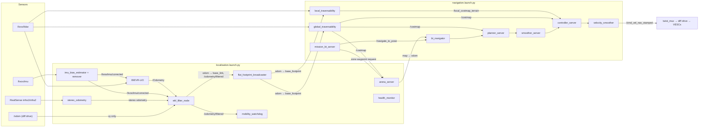
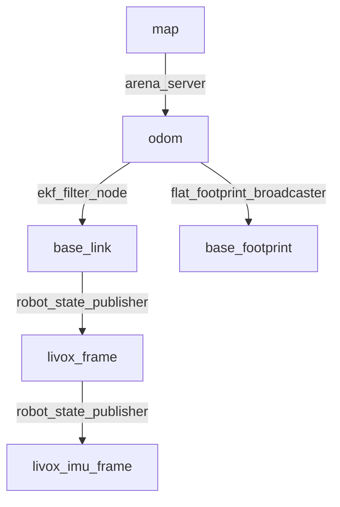

# Perseus nav stack

[][ros-jazzy]
[][nav2]
[](#requirements)
[](#license)

Adaptive autonomous navigation stack for **Perseus**, the QUT Robotics Club (ROAR) rover, built
for the 2026 NASA International Lunabotics Championship. The stack takes a Livox
MID-360 LiDAR, its IMU and a RealSense stereo camera, and turns them into a
localised rover that plans across unknown regolith, avoids rocks and craters,
and cycles between the excavation and construction zones on its own.

Nothing in the core stack depends on the arena. The same localisation and
terrain costmaps also drive the rover across
[open, uneven 3D terrain](#open-terrain-navigation) with no prior map.


_The base station view: the operator's RViz, running on a laptop, following the
rover over the network._

## Contents

- [Features](#features)
- [Open terrain navigation](#open-terrain-navigation)
- [Architecture](#architecture)
- [Packages](#packages)
- [Requirements](#requirements)
- [Building](#building)
- [Quick start](#quick-start)
- [Base station](#base-station)
- [Running missions](#running-missions)
- [Launch file reference](#launch-file-reference)
- [Node reference](#node-reference)
- [Configuration](#configuration)
- [Debugging and tuning](#debugging-and-tuning)
- [Troubleshooting](#troubleshooting)
- [Safety](#safety)
- [Contributing](#contributing)
- [License](#license)
- [See also](#see-also)

## Features

- **LiDAR-inertial localisation.** BIEVR-LIO odometry fused with gyro rates,
  stereo visual odometry and a diff-drive no-sideslip constraint in a
  `robot_localization` EKF.
- **Open 3D terrain, no prior map.** Full 6-DOF state estimation and
  slope- and step-aware terrain analysis, so the rover can navigate open
  outdoor ground as well as the arena.
- **Arena-frame localisation from fiducials.** `arena_server` fixes the rover
  pose from ArUco markers on the arena rail and publishes `map -> odom`, so
  goals can be given in guidebook coordinates.
- **Terrain-aware costmaps from the raw scan.** Two traversability nodes share
  one height-difference classifier:
  - `global_traversability` remembers the whole arena with log-odds, for the
    planner.
  - `local_traversability` forgets after 1 s over an 8 m window, for the
    controller.
- **Tuned Nav2 for a skid-steer on sand.** Theta\* planning, path smoothing,
  Regulated Pure Pursuit (DWB selectable live), and speed floors kept above
  the ESC stall speed.
- **Behaviour-tree missions.** `mission_bt_server` runs excavation ↔
  construction cycles, asks `arena_server` for safe waypoints inside each zone,
  and reports progress on a latched status topic.
- **Health and slip monitoring.** `health_check` reports rate, bandwidth and
  staleness of every key topic. `watchdog` detects sustained wheel slip by
  comparing commanded velocity against the EKF.
- **Bandwidth-aware base station.** Clouds cross the radio Draco-compressed.
  The base station decodes them, builds the terrain mesh locally, and draws
  the arena from its own copy of the layout file, so only a pose crosses the
  link for the minimap.
- **Manual override always wins.** `twist_mux` ranks the joystick above
  navigation, so holding the deadman takes over from Nav2 at once.

## Open terrain navigation

The stack isn't limited to a walled arena. It navigates open, uneven 3D
terrain with no prior map:

- **Full 3D state estimation.** BIEVR-LIO and the EKF estimate x, y, z, roll,
  pitch and yaw (`two_d_mode: false`), so slopes, mounds and craters are
  tracked, not flattened away.
- **Terrain analysis, not a flat-floor assumption.** Each cell is judged
  against the local ground from the raw 3D scan. A drivable slope up to
  `max_slope_deg` (40°) reads as free. Steps up (`max_step_up_m`), drops
  (`max_step_down_m`) and anything standing proud of the ground
  (`max_height_above_ground_m`) read as obstacles. Overhead returns above
  `obstacle_height_cap_m` are ignored, so the rover can drive under them.
- **No walls or prior map needed.** Both costmaps come from live LiDAR only.
  `global_traversability` starts at 40 m × 40 m and grows in 10 m steps as
  the rover explores, and unmapped ground is plannable by default.
- **Drift-free classification.** Cells are classified from the last second
  of raw scans, then folded into a log-odds memory. Slow odometry drift
  never shows up as a false step between two visits to the same spot.

### Running outside the arena

Launch localisation and navigation as usual, then send goals in `odom` with
**2D Goal Pose** or `NavigateToPose`. The arena-specific parts are optional:

- Ignore `arena_server`'s `map` frame. It's seeded from the arena starting
  pose and only means something inside the arena.
- The zone missions (`/mission/*`, `/arena/request_*_waypoint`) assume the
  Lunabotics layout. Use plain Nav2 goals or `waypoint_follower` instead.
- On bigger ground, raise `max_range_m` on both traversability nodes, and
  `max_size` in `bievr_mid360.yaml` if the computer has the memory.

### Open terrain limits

- **2.5D planning.** Nav2 plans on a 2D cost grid built from the 3D terrain
  analysis. It can't route over and under the same spot, such as a bridge.
- **Odometry only.** Away from the arena fiducials there's no absolute fix,
  so position drifts slowly over long runs. Add GNSS or another global
  source to the EKF for kilometre-scale missions.
- **Drop-offs.** A real edge often shows up as _no_ returns, not low ones,
  and unknown ground is treated as free. See [Safety](#safety).
- **Tuned for Lunabotics regolith.** The speed limits, stall floors and
  thresholds suit a slow skid-steer on sand. Retune `navigation.yaml` for
  other vehicles or surfaces.

## Architecture

The stack splits into three layers: localisation, navigation, and the operator
base station. The robot runs the first two and the base station runs on any
machine that shares the robot's ROS domain.



### TF tree

The EKF is the only owner of `odom -> base_link`. BIEVR-LIO publishes no TF of
its own.



- `map` is the **arena frame**: the guidebook Origin Point at the centre of
  the front (south) wall, +X east, +Y north, Z up at grade.
- `odom` is BIEVR-LIO's world frame, and **every Nav2 `global_frame` is
  `odom`**. Goals in `map` still work because Nav2 transforms them through
  `map -> odom`.
- `base_footprint` is `base_link` flattened to the ground plane: z, roll and
  pitch dropped, yaw kept. Nav2's costmaps and controller use it.

### Velocity path

```text
controller_server -> velocity_smoother --(cmd_vel_nav_stamped)--> twist_mux -> diff_drive_controller
                                                                     ^
                                  joy_vel (100) > key_vel (90) > web_vel (80) > nav (10)
```

## Packages

| Package                                          | Kind            | Purpose                                                                                                      |
| ------------------------------------------------ | --------------- | ------------------------------------------------------------------------------------------------------------ |
| [`autonomy_bringup`](autonomy_bringup)           | Launch + config | Launch files, parameters, behaviour trees and RViz configs for the whole stack.                              |
| [`arena_server`](arena_server)                   | C++ node        | Arena layout, fiducial localisation (`map -> odom`), safe zone waypoints, and the base-station minimap node. |
| [`global_traversability`](global_traversability) | C++ node        | Map-wide terrain costmap with log-odds memory, published on `/costmap`.                                      |
| [`local_traversability`](local_traversability)   | C++ node        | Reactive 8 m terrain costmap at 10 Hz, published on `/local_costmap_terrain`.                                |
| [`footprint_broadcaster`](footprint_broadcaster) | C++ node        | Derives `odom -> base_footprint` from the EKF's `odom -> base_link`.                                         |
| [`mission_bt_server`](mission_bt_server)         | C++ node        | BehaviorTree.CPP mission runner behind the RViz Mission Control panel.                                       |
| [`watchdog`](watchdog)                           | C++ node        | Mobility watchdog that detects sustained wheel slip.                                                         |
| [`health_check`](health_check)                   | C++ node        | Type-agnostic topic health monitor: rate, bandwidth, staleness.                                              |

## Requirements

- **ROS 2 Jazzy** on Ubuntu 24.04, or the repository's Nix `devenv` shell,
  which pins the distro for you.
- A C++20 compiler and CMake ≥ 3.23.
- ROS dependencies:
  - `navigation2` (planner, controller, smoother, behaviors, bt_navigator,
    waypoint_follower, velocity_smoother, lifecycle_manager)
  - `robot_localization`
  - `behaviortree_cpp` (BTCPP v4) and `nav2_behavior_tree`
  - `tf2_ros`, `visualization_msgs`, `nav_msgs`, `sensor_msgs`, `std_srvs`
- Perseus workspace packages this stack depends on:
  - `bievr_lio_ros2`: LiDAR-inertial odometry.
  - `interfaces`: `LocaliseInArena`, `RequestZoneWaypoint`, `StartMission`,
    `MissionStatus`, `MobilityStatus`, `SystemHealth` and friends.
  - `sensors`: Livox and RealSense drivers, IMU bias processing, Draco
    point-cloud compression, `cloud_mesher`.
  - `vision`: `stereo_odometry` and the ArUco detector.
  - `perseus`: `twist_mux` and the diff-drive controller.
  - `teleop`: joystick override.
  - `rviz_plugins`: Topic Health, Arena Minimap, Mobility Efficiency,
    Mission Control and View Lock panels.

### Hardware

| Component                                   | Used for                         |
| ------------------------------------------- | -------------------------------- |
| Livox MID-360 (LiDAR + built-in IMU)        | Odometry, terrain costmaps       |
| Intel RealSense D455                        | Stereo odometry, ArUco fiducials |
| Diff-drive base on VESC ESCs                | Motion, sideslip constraint      |
| Onboard computer (Jetson / Orange Pi class) | Runs localisation and navigation |
| Operator laptop + gamepad                   | Base station and manual override |

## Building

The nav stack lives inside the `perseus-v3` ROS workspace at
`software/ros_ws/src/nav-stack`.

### Building with the Nix devenv

From the repository root, enter the development shell (it loads automatically
with `direnv`) and build:

```shell
cd perseus-v3
devenv shell
cd software/ros_ws
colcon build --packages-up-to autonomy_bringup
source install/setup.bash
```

### Building in a plain ROS 2 workspace

```shell
source /opt/ros/jazzy/setup.bash
cd software/ros_ws
rosdep install --from-paths src --ignore-src -r -y
colcon build --packages-up-to autonomy_bringup \
    --cmake-args -DCMAKE_BUILD_TYPE=RelWithDebInfo
source install/setup.bash
```

> [!NOTE]
> Packages default to a `Debug` build. A `Release` build is promoted to
> `RelWithDebInfo` so stack traces keep their symbols, and any `Rel*` build
> compiles with `-Werror`.

If `colcon` fails after a `git pull` for no obvious reason, clean and rebuild:
`colcon clean workspace -y && colcon build`.

## Quick start

Start the robot in this order, one terminal each. Start order between
localisation and navigation does not matter for correctness, but the sensors
and robot description must be up before odometry can publish.

### Running on the robot

1.  Start the sensor drivers (Livox and RealSense):

    ```shell
    ros2 launch sensors sensors.launch.py
    ```

1.  Start the base: robot description, `twist_mux` and the diff-drive
    controller:

    ```shell
    ros2 launch perseus perseus.launch.py
    ```

1.  Start localisation. **Keep the rover still for the first ~2 s** while
    BIEVR-LIO levels its world frame from the IMU (`imu.t_init`).

    ```shell
    ros2 launch autonomy_bringup localisation.launch.py
    ```

    Pass `enable_sensors:=true` instead of running step 1 to have this file
    start the Livox and RealSense itself. That also composes
    `stereo_odometry` into the camera container, which runs at 30 Hz instead
    of about 4 Hz standalone.

1.  Start navigation. **From here the rover can move.**

    ```shell
    ros2 launch autonomy_bringup navigation.launch.py
    ```

### Running the base station

On the operator laptop, on the same `ROS_DOMAIN_ID`, with the gamepad plugged
in:

```shell
ros2 launch autonomy_bringup base_station.launch.py
```

Click **2D Goal Pose** in RViz to send the rover somewhere, or use the Mission
Control panel to run a full mission.

### Running in simulation

The Gazebo simulation lives in the separate `perseus_simulation` workspace.
With the simulator publishing `/clock`:

```shell
ros2 launch autonomy_bringup localisation.launch.py sim:=true use_sim_time:=true
ros2 launch autonomy_bringup navigation.launch.py use_sim_time:=true
ros2 launch autonomy_bringup base_station.launch.py use_sim_time:=true
```

`sim:=true` layers `bievr_mid360_sim.yaml` over the real-robot LIO config to
accept Gazebo's untimed point cloud.

## Base station

`base_station.launch.py` is everything an operator needs, and nothing that
estimates or plans. It runs:

- **RViz** with `rviz/base_station.rviz`, wrapped in nixGL by default.
- **Draco decoders** (`sensors/point_cloud_decompress.launch.py`) that turn
  the rover's compressed clouds back into
  `/livox/lidar/downsampled/decompressed` and
  `/Laser_map/downsampled/decompressed`.
- **`cloud_mesher`**, which rebuilds a terrain surface from the decoded map
  and publishes it on `/mesh`. It runs here on purpose: a triangle mesh is
  roughly ten times the bytes of the cloud it came from, so it never touches
  the radio link.
- **The joystick override** (`teleop/controller.launch.py`), which stays live
  even with `rviz_only:=true`.

### RViz panels

| Panel               | Topic                       | Shows                                                                                                       |
| ------------------- | --------------------------- | ----------------------------------------------------------------------------------------------------------- |
| Topic Health        | `/health_check/health`      | Rate, bandwidth and staleness per monitored topic. The fastest way to tell a link problem from a dead node. |
| Arena Minimap       | `/arena/robot_pose`         | 2D overhead arena with rover position and heading, drawn from the local layout file.                        |
| Mobility Efficiency | `/watchdog/mobility_status` | Percentage of commanded linear and angular motion achieved.                                                 |
| Mission Control     | `/mission/*`                | Start and stop missions, pick excavation and construction points.                                           |
| View Lock           | —                           | Locks the camera to preset follow views.                                                                    |

### RViz displays

| Display              | Topic                                   |
| -------------------- | --------------------------------------- |
| Livox Cloud          | `/livox/lidar/downsampled/decompressed` |
| Cloud Map            | `/Laser_map/downsampled/decompressed`   |
| Global Mesh Map      | `/mesh`                                 |
| Footprint (odometry) | `/odometry/filtered`                    |
| Path                 | `/plan_smoothed`                        |
| Global 2D Projection | `/layers/obstacle`                      |
| Global Inflation     | `/layers/inflation`                     |
| Local 2D Projection  | `/local_costmap/costmap`                |
| Arena Zones          | `/arena/zones`                          |
| Mission Waypoints    | `/mission/waypoint_markers`             |
| Detection Overlay    | `/vision/overlay/image/compressed`      |

The fixed frame is `odom`. The toolbar adds **ExcavationPoint** and
**ConstructionPoint** tools for picking mission points on the map, alongside
the standard **2D Goal Pose** on `/goal_pose`.

## Running missions

`mission_bt_server` runs `behavior_trees/mission.xml`. It only decides **where**
to go and **in what order**. Every leg is a call into bt_navigator's
`/navigate_to_pose`, so planning, smoothing, replanning and recovery all come
from `navigate_to_pose_w_smoothing.xml`.

### Mission modes

| Mode                  | Task                     | Behaviour                                                             |
| --------------------- | ------------------------ | --------------------------------------------------------------------- |
| `FULL_AUTONOMY` (0)   | ignored                  | Excavation, then `cycles` × (dig → construction → dump → excavation). |
| `NAVIGATION_ONLY` (1) | `CYCLE` (0)              | Same loop without the bucket steps.                                   |
| `NAVIGATION_ONLY` (1) | `GO_TO_EXCAVATION` (1)   | One trip to the excavation point.                                     |
| `NAVIGATION_ONLY` (1) | `GO_TO_CONSTRUCTION` (2) | One trip to the construction point.                                   |

At construction, the `DumpBucket` subtree dumps the load. Each step is one
`MoveBucket` goal, and joints a step does not name hold where they are:

1. Lift 20° and tilt 20° together, to lower the arms and tip the bucket.
2. Jaw to 36°, to open the clamshell.
3. Tilt to −20°, to curl back and empty the rest.
4. The travel pose with the jaw closed, all three joints at once.

The steps use `bucket_move_s` and the travel pose parameters below. If a step
fails, the mission fails there, with the rover still at construction.

> [!IMPORTANT]
> The dig step is still a **placeholder**: a timed `Sleep` of `zone_pause_s`
> seconds (default 2 s). Replace the `Sleep` in `FullAutonomyCycle` with the
> real dig action when it exists. Nothing else in the tree has to change.

For each zone, the waypoint comes either from a point picked in RViz or, with
`use_arena_*: true`, from `arena_server`. The server scores candidates inside
the zone against `/costmap` for clearance and distance to the rover.

### Bucket travel pose

With `prepare_bucket: true` (the Mission Control panel's **Bucket** tick box,
on by default), the mission first runs the `PrepareBucket` subtree before any
mode or task: every bucket joint to 0°, then the travel pose. The default pose
is lift 25°, tilt −20° (curled), jaw 0°. It keeps the bucket out of the MID-360's
and D455's view of the ground from 2 m ahead while leaving about 0.17 m of
ground clearance. With the arms up (lift 0) the bucket hides most of the lidar's
far-field ground returns.

| Parameter                | Default                                                          |
| ------------------------ | ---------------------------------------------------------------- |
| `bucket_action_name`     | `/payloads/bucket_trajectory_controller/follow_joint_trajectory` |
| `bucket_travel_lift_deg` | `25.0`                                                           |
| `bucket_travel_tilt_deg` | `-20.0`                                                          |
| `bucket_travel_jaw_deg`  | `0.0`                                                            |
| `bucket_move_s`          | `10.0` (each move's `time_from_start`)                           |

Each move is a `MoveBucket` node: one `FollowJointTrajectory` goal, which
succeeds when the bucket controller reports the pose reached. If the controller
is not running, the mission fails at `bucket_to_zero` before the rover drives.
Missions without `prepare_bucket` never touch the bucket and run without the
controller. Stopping the mission mid-move cancels the goal, and the bucket holds
where it is.

### Mission commands from the CLI

The Mission Control panel wraps these services.

```shell
# Two navigation-only cycles, with arena_server picking both waypoints
ros2 service call /mission/start interfaces/srv/StartMission \
    "{mode: 1, task: 0, cycles: 2, use_arena_excavation: true, use_arena_construction: true}"

# The same, moving the bucket to its travel pose first
ros2 service call /mission/start interfaces/srv/StartMission \
    "{mode: 1, task: 0, cycles: 2, use_arena_excavation: true, use_arena_construction: true, prepare_bucket: true}"

# Watch progress (latched: late subscribers get the current state at once)
ros2 topic echo /mission/status

# Cancel
ros2 service call /mission/stop std_srvs/srv/Trigger

# One-shot trips to a safe point in a zone
ros2 service call /mission/go_to_excavation_zone std_srvs/srv/Trigger
ros2 service call /mission/go_to_construction_zone std_srvs/srv/Trigger
```

### Localising in the arena

`arena_server` seeds `map -> odom` at startup from `initial_pose` (the centre of
the starting zone, facing north). The guidebook randomises the real start pose,
so correct it with a fiducial fix once at least two rail markers are in view:

```shell
ros2 service call /arena/localise interfaces/srv/LocaliseInArena "{timeout_s: 2.0}"
```

The response carries the pose, the marker IDs used, and `residual_m`, the RMS
error of the rigid fit. Gate on `residual_m`: it jumps if a detection is
spurious or a marker has been moved.

## Launch file reference

All launch files are in `autonomy_bringup/launch`.

### `localisation.launch.py` arguments

Brings up the IMU bias container, BIEVR-LIO, the EKF, `stereo_odometry` and
the ArUco detector (via `vision.launch.py`), `flat_footprint_broadcaster`,
`arena_server`, `mobility_watchdog`, `health_monitor` and the rover-side Draco
compressor.

| Argument            | Default                  | Description                                                               |
| ------------------- | ------------------------ | ------------------------------------------------------------------------- |
| `sim`               | `false`                  | Layer `bievr_mid360_sim.yaml` for Gazebo's point cloud.                   |
| `use_sim_time`      | `false`                  | Use `/clock`. The EKF waits forever if nothing publishes it.              |
| `rviz`              | `false`                  | Open BIEVR-LIO's own RViz config.                                         |
| `ekf_params_file`   | `config/ekf_config.yaml` | EKF parameters.                                                           |
| `bievr_params_file` | _(empty)_                | Replace `bievr_mid360.yaml`, e.g. to A/B test against a bag.              |
| `enable_sensors`    | `false`                  | Start the Livox and RealSense from this file. Strictly `true` or `false`. |
| `interface`         | `enP3p49s0`              | Network interface the Livox driver reads the host IP from.                |
| `aruco`             | `true`                   | Launch the ArUco detector.                                                |
| `cube`              | `false`                  | Launch the cube detector.                                                 |
| `overlay`           | `true`                   | Launch the detection overlay.                                             |

### `navigation.launch.py` arguments

Brings up both traversability nodes, the Nav2 servers, `mission_bt_server` and
the lifecycle manager. Everything is configured from `config/navigation.yaml`.

| Argument       | Default | Description   |
| -------------- | ------- | ------------- |
| `use_sim_time` | `false` | Use `/clock`. |

Prerequisites: `localisation.launch.py` for TF, and `perseus.launch.py` for
`twist_mux` and the diff-drive controller.

### `base_station.launch.py` arguments

| Argument          | Default                  | Description                                                            |
| ----------------- | ------------------------ | ---------------------------------------------------------------------- |
| `rviz_config`     | `rviz/base_station.rviz` | RViz config to open.                                                   |
| `use_sim_time`    | `false`                  | Honour `/clock` when following a simulated robot.                      |
| `use_nixgl`       | `true`                   | Wrap RViz in nixGL. Set `false` on a machine with working GPU drivers. |
| `decompress`      | `true`                   | Run the Draco decoders.                                                |
| `mesh`            | `true`                   | Run `cloud_mesher` on the decoded map. Needs `decompress:=true`.       |
| `minimap`         | `false`                  | Publish arena zones as 3D markers. The RViz panel does not need this.  |
| `rviz_only`       | `false`                  | Launch RViz alone; overrides `decompress`, `mesh` and `minimap`.       |
| `teleop`          | `true`                   | Run the joystick override.                                             |
| `controller_type` | `taranis`                | One of `taranis`, `xbox`, `logitech`, `8bitdo`.                        |

### Other launch files

| Launch file                                   | Purpose                                                             |
| --------------------------------------------- | ------------------------------------------------------------------- |
| `ekf.launch.py`                               | The EKF on its own (`params_file`, `use_sim_time`, default `true`). |
| `arena_server.launch.py`                      | `arena_server` with `arena_layout.yaml` and `arena_layout.json`.    |
| `arena_minimap.launch.py`                     | Base-station 3D minimap markers from the local layout file.         |
| `health_check/launch/health_check.launch.py`  | Health monitor (`config_file`).                                     |
| `watchdog/launch/mobility_watchdog.launch.py` | Mobility watchdog (`use_sim_time`).                                 |

## Node reference

### `arena_server`

Owns the arena frame, localises against rail fiducials on request, and picks
safe waypoints inside mission zones.

| Interface    | Name                                   | Type                                                     |
| ------------ | -------------------------------------- | -------------------------------------------------------- |
| TF broadcast | `map -> odom`                          | seeded from `initial_pose`, refined by `/arena/localise` |
| Service      | `/arena/localise`                      | `interfaces/srv/LocaliseInArena`                         |
| Service      | `/arena/request_excavation_waypoint`   | `interfaces/srv/RequestZoneWaypoint`                     |
| Service      | `/arena/request_construction_waypoint` | `interfaces/srv/RequestZoneWaypoint`                     |
| Subscribes   | `/vision/aruco/detections`             | `interfaces/msg/DetectionArray` (on demand only)         |
| Subscribes   | `/costmap`                             | `nav_msgs/OccupancyGrid`                                 |
| Publishes    | `/arena/zones`                         | `visualization_msgs/MarkerArray` (transient local)       |
| Publishes    | `/arena/robot_pose`                    | `geometry_msgs/PoseStamped` (5 Hz)                       |

Localisation needs **at least two markers**. The fit uses marker positions
(closed-form 2D Kabsch), because a single marker's orientation has measured
yaw errors of up to 9.4°. The node refuses to start without `layout_file`
rather than fall back to a built-in arena.

### `arena_minimap`

Also in the `arena_server` package, run on the base station. It reads the same
`arena_layout.json`, subscribes to `/arena/robot_pose`, and publishes
`/minimap/zones` and `/minimap/robot` markers. The rover marker greys out after
`pose_timeout_s` (3 s) without a pose, rather than vanishing.

### `global_traversability`

| Interface  | Name                                                     | Notes                                     |
| ---------- | -------------------------------------------------------- | ----------------------------------------- |
| Subscribes | `/livox/lidar`                                           | best effort                               |
| Publishes  | `/costmap`                                               | `nav_msgs/OccupancyGrid`, transient local |
| Publishes  | `/layers/{log_odds,elevation,border,obstacle,inflation}` | debug grids                               |

Every `update_period_s` (0.5 s) it classifies the last `point_buffer_s` (1 s)
of raw scans and folds each observed cell's verdict into a persistent log-odds.
Unobserved cells keep their last value, and a removed rock clears the next time
the LiDAR looks at it. The grid grows in 10 m steps as the rover explores.

### `local_traversability`

| Interface  | Name                                                                                                  | Notes                                  |
| ---------- | ----------------------------------------------------------------------------------------------------- | -------------------------------------- |
| Subscribes | `/livox/lidar`                                                                                        | best effort                            |
| Publishes  | `/local_costmap_terrain`                                                                              | `nav_msgs/OccupancyGrid`, **volatile** |
| Publishes  | `/local_layers/{elevation,step_up,step_down,height_above_ground,clearance,border,obstacle,inflation}` | debug grids                            |

Rebuilds an 8 m window at 10 Hz and throws it away every cycle. It is a plain
node, not a lifecycle node. Without TF or scans it logs a throttled
`Dropping scan` and Nav2 falls back to the global map alone.

### The terrain classifier

Both traversability nodes share `terrain_analysis.hpp`. A cell is an obstacle
when, against the lowest return within `ground_window_m` (with a
`max_slope_deg` allowance), its floor steps up more than `max_step_up_m`,
something stands higher than `max_height_above_ground_m`, or it drops more than
`max_step_down_m`. Blobs smaller than `min_obstacle_cells` are erased, then the
result is inflated the same way as Nav2's `InflationLayer`.

### `flat_footprint_broadcaster`

Looks up `odom -> base_link` and broadcasts `odom -> base_footprint` at
`publish_rate_hz` (30 Hz), keeping x, y and yaw.

### `mission_bt_server`

| Interface     | Name                               | Type                                     |
| ------------- | ---------------------------------- | ---------------------------------------- |
| Service       | `/mission/start`                   | `interfaces/srv/StartMission`            |
| Service       | `/mission/stop`                    | `std_srvs/srv/Trigger`                   |
| Service       | `/mission/go_to_excavation_zone`   | `std_srvs/srv/Trigger`                   |
| Service       | `/mission/go_to_construction_zone` | `std_srvs/srv/Trigger`                   |
| Publishes     | `/mission/status`                  | `interfaces/msg/MissionStatus` (latched) |
| Action client | `/navigate_to_pose`                | `nav2_msgs/action/NavigateToPose`        |

It registers the custom `RequestZoneWaypoint` BT node, which calls an
`arena_server` waypoint service and writes the result to the blackboard.

### `mobility_watchdog`

| Interface  | Name                        | Type                            |
| ---------- | --------------------------- | ------------------------------- |
| Subscribes | `/cmd_vel_out`              | `geometry_msgs/TwistStamped`    |
| Subscribes | `/odometry/filtered`        | `nav_msgs/Odometry`             |
| Publishes  | `/watchdog/mobility_status` | `interfaces/msg/MobilityStatus` |

A channel reports slip when its mean slip ratio over `detection_window_s`
(0.75 s) reaches `slip_ratio_threshold` (0.4), which means the rover achieved
60 % or less of the commanded speed. It ignores commands below 0.1 m/s or
0.1 rad/s and the first `activation_grace_period_s` (0.4 s) of each command.
The EKF deliberately does not fuse wheel vx, so this compares against a
velocity the wheels cannot fake.

### `health_monitor`

Publishes one `interfaces/msg/SystemHealth` snapshot per second on
`/health_check/health`. Each topic reads `OK`, `SLOW` (below
`rate_tolerance` × expected), `STALE` (publisher present, silent for
`stale_timeout_sec`), or `NO_PUBLISHER`. Adding a topic is a config change:
append to both `topics` and `expected_rates_hz` in `health_check.yaml`.

## Configuration

All stack configuration lives in `autonomy_bringup/config`. The files are
heavily commented with the measurements behind each value, so read the comment
before changing a number.

| File                                    | Configures                                                                 |
| --------------------------------------- | -------------------------------------------------------------------------- |
| `navigation.yaml`                       | Both traversability nodes and every Nav2 server.                           |
| `ekf_config.yaml`                       | `robot_localization` sensor fusion.                                        |
| `bievr_mid360.yaml`                     | BIEVR-LIO on the real rover. Parsed by yaml-cpp, not a ROS parameter file. |
| `bievr_mid360_sim.yaml`                 | Simulation-only overrides, merged per key over the file above.             |
| `arena_layout.json`                     | Zones and fiducials. **Shared by the robot and the base station.**         |
| `arena_layout.yaml`                     | `arena_server` behaviour: initial pose, localisation and waypoint scoring. |
| `footprint_broadcaster.yaml`            | Frames and rate for `flat_footprint_broadcaster`.                          |
| `health_check/config/health_check.yaml` | Watch list and expected rates.                                             |
| `watchdog/config/watchdog.yaml`         | Slip detection thresholds.                                                 |

### Arena layout

`arena_layout.json` describes the arena in the guidebook's coordinate frame:

| Zone                | Centre (x, y) m | Size (w × h) m |
| ------------------- | --------------- | -------------- |
| `starting_zone`     | (-1.125, 1.125) | 2.25 × 2.25    |
| `excavation_zone`   | (0.0, 1.5)      | 9.14 × 3.0     |
| `obstacle_zone`     | (0.0, 5.55)     | 9.14 × 5.1     |
| `construction_zone` | (3.545, 6.395)  | 2.05 × 3.41    |
| `target_berm_area`  | (3.56, 6.4)     | 0.9 × 2.2      |

Fiducials are ArUco dictionary 9 markers (IDs 67, 68, 69) with a 0.238 m
printed square, 0.4625 m apart along the rail.

> [!WARNING]
> The layout is **provisional**. Guidebook sections 3.1 and 5.7 call the
> published layout a placeholder. Re-measure into this one file, and make sure
> the robot and the base station read the **same copy**: if they differ, the
> base station draws an arena the rover is not in and nothing reports an error.

The file deliberately carries no wall or arena extent. Guidebook 5.6.3
forbids a priori wall information, and nothing in the stack localises from
walls.

### Key navigation parameters

| Parameter                                  | Value                            | Why                                                            |
| ------------------------------------------ | -------------------------------- | -------------------------------------------------------------- |
| `velocity_smoother.max_velocity`           | `[0.28, 0.0, 0.28]`              | Binding speed ceiling for both controllers, 30 % below teleop. |
| `FollowPath.min_approach_linear_velocity`  | `0.12`                           | Nav2's 0.05 default is the exact ESC stall speed.              |
| `FollowPath.rotate_to_heading_angular_vel` | `0.175`                          | Barely above the ~0.15 rad/s body-yaw stall. Do not lower.     |
| `goal_checker.xy_goal_tolerance`           | `0.35`                           | The rover hunts across a tighter goal on sand.                 |
| `progress_checker.movement_time_allowance` | `20.0`                           | Sand slip and stalls are recoverable.                          |
| Default planner / controller               | `ThetaStar` / `FollowPath` (RPP) | Set in `navigate_to_pose_w_smoothing.xml`.                     |

Switch planner or controller live, before sending a goal:

```shell
ros2 topic pub -1 /planner_selector std_msgs/String "{data: GridBased}"
ros2 topic pub -1 /controller_selector std_msgs/String "{data: DWB}"
```

## Debugging and tuning

### Testing the planner with `plan_probe.py`

`autonomy_bringup/scripts/plan_probe.py` turns RViz's **2D Goal Pose** into a
planner test that reports path length, detour ratio, planning time and a
decoded `error_code`. It works with `planner_server` running alone, without
`bt_navigator`.

```shell
python3 autonomy_bringup/scripts/plan_probe.py              # goals from RViz
python3 autonomy_bringup/scripts/plan_probe.py --goal 3.0 1.5   # one goal, then exit
```

A detour ratio much above 1.5 on open ground means the planner is routing
around something. Check `/costmap` for a false obstacle.

### Useful checks

```shell
ros2 topic echo /health_check/health --once          # is every input alive?
ros2 topic hz /Odometry                              # LIO keeping up with the 10 Hz LiDAR?
ros2 topic echo /watchdog/mobility_status            # slipping?
ros2 lifecycle get /planner_server                   # should be "active"
ros2 param set /bievr_lio odom_position_variance 0.0004   # live covariance tuning
```

### Non-obvious configuration traps

These are documented in `navigation.yaml` and each has cost the team an
afternoon.

- **`trinary_costmap`, `lethal_cost_threshold`, `track_unknown_space`,
  `unknown_cost_value` and `use_maximum` belong at the costmap level**, not
  under `static_layer`. Nested under a layer they are silently ignored.
- **QoS must match.** `/costmap` is transient local, so the static layer
  needs `map_subscribe_transient_local: true`. `/local_costmap_terrain` is
  volatile, so its layer needs `false`. A mismatch logs nothing and delivers
  nothing.
- **`enable_stamped_cmd_vel: true` everywhere.** `twist_mux` uses stamped
  twists. With it off, Nav2 runs perfectly and the wheels never turn.
- **The `cmd_vel_smoothed -> /cmd_vel_nav_stamped` remap** in
  `navigation.launch.py` is the one line that connects Nav2 to the rover.
- **`lifecycle_manager.node_names` must match the launched nodes exactly.**
  Naming a node that is not running hangs bringup on a bond that never forms.
- **Unmapped ground.** Crossing never-seen ground depends on three settings
  together: `treat_unknown_as_obstacle: false`, `allow_unknown: true`, and
  `track_unknown_space: false`. Search `navigation.yaml` for `UNMAPPED`.
- **Scope every launch include.** An unscoped `IncludeLaunchDescription`
  leaks its arguments into every later include. That once handed the health
  monitor the wrong parameter file and an empty watch list.

## Troubleshooting

| Symptom                                                             | Likely cause                                                                                        |
| ------------------------------------------------------------------- | --------------------------------------------------------------------------------------------------- |
| EKF never publishes                                                 | `use_sim_time:=true` with nothing publishing `/clock`.                                              |
| No `/Odometry`                                                      | BIEVR-LIO waits for `livox_frame -> base_link` in TF. Start `perseus.launch.py`.                    |
| Stuck at `Waiting for the livox_imu_frame -> livox_frame transform` | Old simulator description. See `bievr_mid360_sim.yaml`.                                             |
| Planner `TF_ERROR` (202)                                            | No `odom -> base_footprint`. Localisation is not running.                                           |
| Planner `START/GOAL_OUTSIDE_MAP` (203/204)                          | `/costmap` never arrived. Check the QoS setting above.                                              |
| Planner `START/GOAL_OCCUPIED` (205/206)                             | A false obstacle under the rover or goal. Inspect `/layers/obstacle`.                               |
| Path plans but the rover does not move                              | Missing stamped cmd_vel, the remap, or a higher-priority `twist_mux` input publishing continuously. |
| Rover stalls near goals or mid-turn                                 | A velocity below the ESC stall floor. Check the `STALL` comments in `navigation.yaml`.              |
| `no free point ... found in zone 'construction_zone'`               | Wall standoff too large for the zone, or the zone is not mapped yet.                                |
| Base station shows no clouds                                        | Draco decoders not running, or the RViz displays point at raw topic names.                          |
| `Device or resource busy` at launch                                 | `enable_sensors:=true` while `sensors.launch.py` is already running.                                |

## Safety

`navigation.launch.py` **moves the rover**. A single click on **2D Goal Pose**
makes it drive.

- **Joystick:** holding the drive deadman takes over from Nav2 within one
  message (`twist_mux` priority 100 against navigation's 10). Releasing it
  hands control back after `twist_mux`'s 0.5 s timeout.
- **E-stop:** the one to actually rely on. Keep it in reach whenever
  navigation is running.

The software makes no guarantee against drop-offs: a real edge usually shows as
_no_ LiDAR returns rather than low ones, and unmapped ground is treated as
free.

## Contributing

Contributions are welcome, from the team and from anyone reusing this stack on
their own rover.

1.  Fork the repository and create a branch following
    [Conventional Branch][conventional-branch] naming, for example
    `feat/nav-stack-dwb-tuning`.
1.  Keep configuration changes in `autonomy_bringup/config`, and **write down
    why** in a comment next to the value. Include the bag or measurement it came
    from, following the style of the existing files.
1.  Build with `-DCMAKE_BUILD_TYPE=RelWithDebInfo` so warnings fail the build.
1.  Test against a replayed bag or the simulator before touching the rover.
1.  Use [Conventional Commits][conventional-commits] and open a pull request
    against `main`.

To report a bug, open an issue with the launch command, the relevant log output,
and a `ros2 topic echo /health_check/health --once` snapshot if you can.

## License

All packages in the nav stack are released under the **MIT License**, as
declared in each `package.xml`.

## Acknowledgements

- [Nav2][nav2] and [robot_localization][robot-localization], which this stack
  is built on.
- BIEVR-LIO, the LiDAR-inertial odometry.
- [BehaviorTree.CPP][btcpp] for mission logic.
- The QUT Robotics Club ROAR team.

## See also

- [Perseus v3 repository][perseus-v3]
- [2026 NASA Lunabotics Challenge][lunabotics]
- [Nav2 documentation][nav2]
- [ROS 2 Jazzy documentation][ros-jazzy]
- [Nav stack image guide](images/README.md)

[btcpp]: https://www.behaviortree.dev/
[conventional-branch]: https://conventional-branch.github.io/
[conventional-commits]: https://www.conventionalcommits.org/
[lunabotics]: https://www.nasa.gov/learning-resources/lunabotics-challenge/
[nav2]: https://docs.nav2.org/
[perseus-v3]: https://github.com/ROAR-QUTRC/perseus-v3
[robot-localization]: https://docs.ros.org/en/jazzy/p/robot_localization/
[ros-jazzy]: https://docs.ros.org/en/jazzy/
